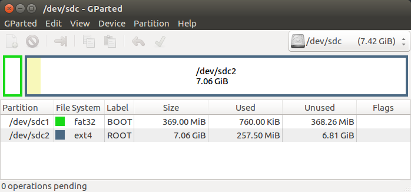

<div>
    <p><a href="https://www.enclustra.com"></a></p>
    <p style="color:white;">&nbsp;</p>
</div>

# Common Information

- [Common Information](#common-information)
  - [Prerequisites](#prerequisites)
  - [Build](#build)
    - [Firmware build](#firmware-build)
    - [Petalinux build](#petalinux-build)
      - [SD card creation](#sd-card-creation)


## Prerequisites
**Hardware**
* [Mercury+ XU8] module (ME-XU8-7EV-1E-D11E)
* [Mercury+ ST1] baseboard
* Class-10 Micro SD card
* 12 V power supply
* Heatsink + Fan
* USB-to-MicroUSB cable
* (Optional): LAN cable

**Software**
* Supported Linux OS for Xilinx tools (see [UG1144] for detailed OS requirements)
* Vivado 2020.1
* Petalinux 2020.1
* Git a distributed version control system
* Serial terminal emulator e.g. minicom

**Documents**
* [XU8+Schematics]
* [ST1+Schematics]

## Build
The Mercury XU8 module and ST1 baseboard reference design is used as a starting point. It contains not only the firmware design, but furthermore the petalinux bsp for the associated devices. Please check the documentation included in the reference design to setup the hardware for SD card boot mode ([XU8-ST1-Manual][XU8+ST1+RefDes+Doc]).

* Clone the correct reference design version
  ```shell
  ~$ git clone https://github.com/enclustra/Mercury_XU8_ST1_Reference_Design -b 2020.1_v1.1.0
  ~$ cd Mercury_XU8_ST1_Reference_Design
  ```

### Firmware build

* Switch to the Reference Design directory
  ```shell
  ~$ cd reference_design
  ```
* Apply the reference design patch.
  ```shell
  ~$ git apply <path-to-this-AppNote>/<select-example>/patch/Mercury_XU8_ST1_Reference_Design.patch
  ```
* Source the environment
  ```shell
  ~$ source <path-to-Vivado-2020.1>/settings64.sh
  ```
* Create and open the Vivado project (the default module in the settings.tcl script after applying the patch is the ME-XU8-7EV-2I-D12E; if you are using a different module, please change this in the settings.tcl script before running the source command from Vivado)
  ```shell
  ~$ vivado -source ./scripts/create_project.tcl
  ```
* Please check the settings using the chapter Firmware Design of the respective example. If changes were necessary or other adjustments were made, regenerate the bitstream.
* Export the `xsa` including the bitstream. Detailed instructions can be found in the reference design documentation.

### Petalinux build
To boot linux on the target device software components are required. In this example Petalinux is used to create these utilizing the Enclustra **BSP** for the XU8/ST1 combination. Download the correct **BSP** file, it follows the naming convention of `Petalinux_${MODULE_NAME}_${BASEBOARD_NAME}_${BOOT_MODE}.bsp`. Using the Mercury `ME-XU8-7EV-2I-D12E` with the ST1 baseboard and SD card boot mode the file will have the name: `Petalinux_ME-XU8-7EV-2I-D12E_ST1_SD.bsp`. It can be found in the release section of the respective reference design. In this case [here](https://github.com/enclustra/Mercury_XU8_ST1_Reference_Design/releases/tag/2020.1_v1.1.0). For more details about Enclustra Petalinux BSPs please visit the [Petalinux documentation repository on Github](https://github.com/enclustra/PetalinuxDocumentation/tree/master).
* Source the Petalinux environment.
  ```shell
  ~$ source <path-to-Petalinux2020.1>/settings.sh
  ```
* Navigate to the folder that contains the Git BSPs.
  ```shell
  ~$ cd petalinux/ME-XU8-7EV-2I-D12E_ST1/
  ```
* Download the BSP for the module that is used.
  ```shell
    ~$ wget https://github.com/enclustra/Mercury_XU8_ST1_Reference_Design/releases/download/2020.1_v1.1.0/Petalinux_ME-XU8-7EV-2I-D12E_ST1_SD.bsp
  ```
* Create the Petalinux project in the same folder as the Git repository.
  ```shell
  ~$ petalinux-create --type project -s Petalinux_ME-XU8-7EV-2I-D12E_ST1_SD.bsp --name sd --force
  ```
  This will create the default Petalinux project for the Mercury XU8 ST1 reference design.
* In most examples a patch needs to be applied in order to make the necessary changes to the default Enclustra Petalinux BSP. The patches in the respective example folder can be used to do this.
  ```shell
  ~$ cd sd
  ~$ git apply <path-to-AppNote>/<select-example>/patch/ME-XU8-7EV-2I-D12E_ST1_SD.patch
  ```
  The directory structure then looks like this:
  ```
  .
  ├── components
  ├── config.project
  ├── hardware
  │   └── vivado_export
  ├── images
  │   └── linux
  └── project-spec
      ├── attributes
      ├── configs
      ├── hw-description
      └── meta-user
  ```
* Change into the newly created Petalinux project and replace the XSA in the `xsa` with the XSA exported from the modified reference design.
  ```shell
   ~$ petalinux-config --get-hw-description=<path-to-XSA> --silentconfig
  ```
* Build project

  The necessary files to boot the system are created now and prepared (bl31.elf, pmufw.elf, zynqmp_fsbl.elf, u-boot.elf, Image, system.dtb).
  ```shell
  ~$ petalinux-build
  ~$ cd images/linux
  ~$ petalinux-package --boot \
      --fsbl zynqmp_fsbl.elf \
      --u-boot u-boot.elf \
      --pmufw pmufw.elf \
      --fpga system.bit
  ```

Refer to [UG1144] for the correct arguments.

#### SD card creation
* Format the sd card and create two partition as shown below.

<p align="center"></br>Example partitioning</p>

* Copy the boot files and the root file system.
```shell
~$ cd images/linux
~$ sudo tar -xpf rootfs.tar.gz -C <path-to-root-partition>
~$ cp {Image,BOOT.BIN,boot.scr,system.dtb} <path-to-boot-partition>
```

[Mercury+ ST1]: https://www.enclustra.com/en/products/base-boards/mercury-st1
[Mercury+ XU8]: https://www.enclustra.com/en/products/system-on-chip-modules/mercury-xu8
[XU8+ST1+RefDes]: https://github.com/enclustra/Mercury_XU8_ST1_Reference_Design/blob/2020.1_v1.1.0
[XU8+ST1+RefDes+Doc]: https://github.com/enclustra/Mercury_XU8_ST1_Reference_Design/blob/2020.1_v1.1.0/reference_design/doc/Mercury_XU8_ST1.pdf
[Petalinux documentation]: https://github.com/enclustra/PetalinuxDocumentation
[UG1221]: https://www.xilinx.com/support/documentation/boards_and_kits/zcu102/2020_1/ug1221-zcu102-base-trd.pdf
[UG1144]: https://www.xilinx.com/support/documentation/sw_manuals/xilinx2020_1/ug1144-petalinux-tools-reference-guide.pdf

<br />
<div>
    <p><a href="https://www.enclustra.com"></a></p>
    <p style="color:white;">
</div>

Please visit https://www.enclustra.com for more information about our **products**, **design services** or **technical questions** and **solutions**.  
