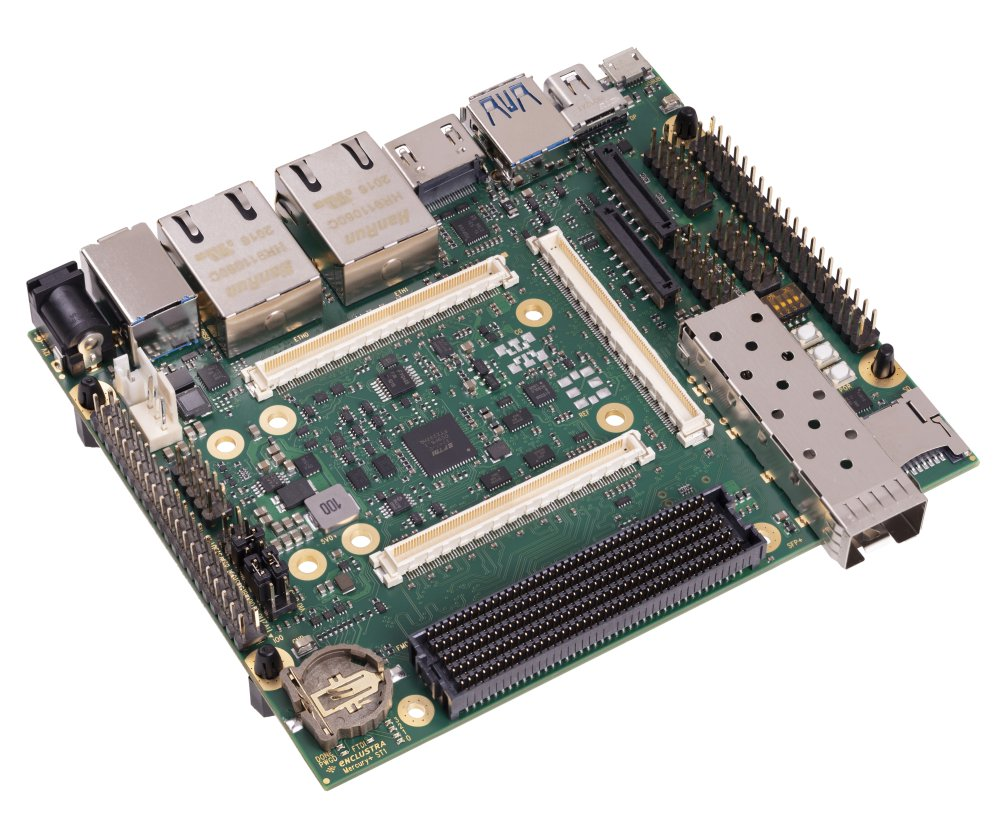
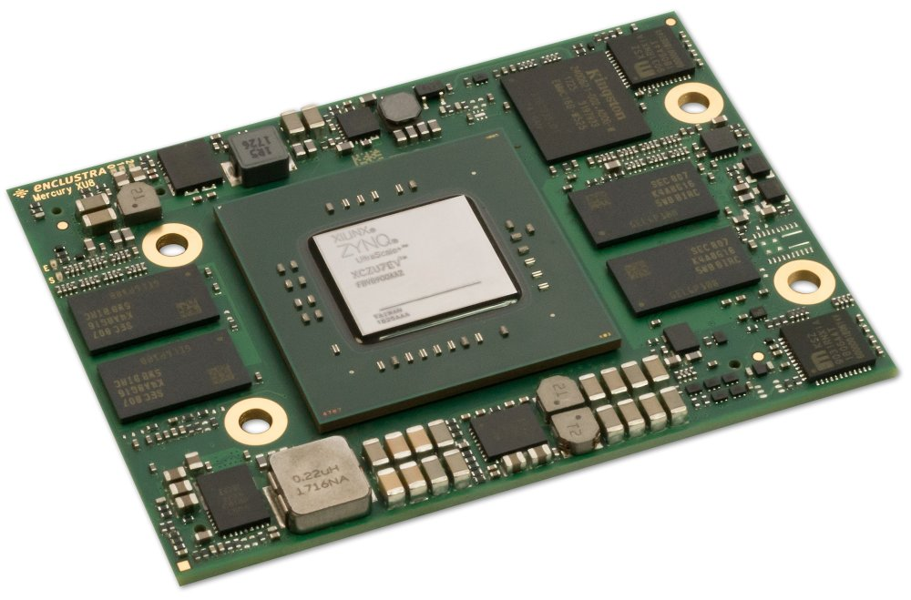

    

    
&nbsp;

# ZynqMP Video Application Note

## Introduction
This appnote demonstrates how you can easily run, implement and prototype video applications on Enclustra hardware. Whether it is a high-resolution camera application via **MIPI** or **USB3.0**, or several displays with different interfaces like **HDMI, DisplayPort** or **MIPI** that also need to be controlled in high resolution, or even highly efficient video encoding with hardware needed to encode and decode **H264** and **H265** codecs, you will find what you are looking for with us.

## About Enclustra

The company Enclustra focuses on the FPGA/SoC technology and making it available to its customers in many different application areas. Enclustra consists of three business units offering different products to customers:

* Standard Platforms
  * [FPGA/SoC modules](https://www.enclustra.com/en/products/system-on-chip-modules/)
  * [Baseboards](https://www.enclustra.com/en/products/base-boards/)
  * The hardware used for this application note consists of such products
* [Intellectual Property](https://www.enclustra.com/en/products/ip-cores/)
  * IP-Cores for complex functionality that can be integrated in custom designs with low effort.
  * Examples are motor control ([EN-DRV](https://www.enclustra.com/en/products/ip-cores/universal-drive-controller/)), host PC communication through Ethernet/USB/PCIe ([EN-MGR](https://www.enclustra.com/en/products/fpga-manager/fpga-manager-ethernet/)) or versatile data buffering in external memory ([EN-SBC](https://www.enclustra.com/en/products/ip-cores/stream-buffer-controller/))
* [Design Services](https://www.enclustra.com/en/design-services/)
  * Enclustra has the know-how to implement custom solutions in all engineering disciplines that are commonly required in FPGA systems:
    * Hardware
    * FPGA Firmware (RTL)
    * Embedded Software (Bare-Metal, RTOS or Linux based)
    * Host Software (e.g. for configuration or data visualization)
  * Enclustra does not only offer turn-key solutions but also collaborates with customers closely by supporting them only in areas they need help in.
    * Example: Enclustra may only develop the FPGA firmware for a project where the customer provides the hardware and implements the embedded software.

## General Information
All examples are based on the current Xilinx tools (Release 2020.1) and our newly created Reference designs and Petalinux BSPs which are hosted on GitHub. [Xilinx Petalinux] offers everything needed to customize, build and implement embedded Linux solutions. Tailored to accelerate design productivity, etc. are just some of the benefits. But for us it basically includes all what we need for the video application, a lot of the driver for the VCU and GPU are not freely available and can uncomfortable to include and patch. Therefore Petalinux definitely offers an uncomplicated and fast way to dive into the "video world".

We will first gives an overview about the hardware and software used. It then sends you directly to the practice orientated examples.

**The heart of appnote will the [Mercury+ XU8] system-on-chip (SoC) in combination with the [Mercury+ ST1] base board.**

The **[Mercury+ ST1]** board is equipped with a multitude of I/O interfaces for use with the Mercury/Mercury+ family of FPGA & SoC modules. And offers all the required graphical interfaces for all kind of cool video applications. It offers everything you could wish for: **MIPI CSI/DSI, HDMI, Mini DisplayPort, USB 3.0** and **SFP+** connectors.

The **[Mercury+ XU8]** SoC module combines Xilinx's Zynq UltraScale+™ MPSoC-series device with fast DDR4 ECC SDRAM, eMMC flash, quad SPI flash, dual Gigabit Ethernet PHY, dual USB 3.0 and thus forms a complete and powerful embedded processing system.

Just to name a few of the most important features and highlights:
* Xilinx® Zynq Ultrascale+™ MPSoC
 * ARM® quad-core Cortex™-A53 (CG variants: dual-core)
 * ARM dual-core Cortex™-R5
 * **Mali-400MP2 GPU** (only for EV variants)
 * **H.264 / H.265** Video Codec (only for EV variants)
 * 16nm FinFET+ FPGA fabric
* PCIe® Gen3 ×16 and PCIe Gen2 ×4
* 20 × 6/12.5/15 Gbit/sec MGT
* 2 × Gigabit Ethernet
* 2 × USB 3.0
* and many more ... visit our website for **[more information][Mercury+ XU8]**

## Examples
It is highly recommended to have a look at a tutorial that takes you through a basic Zynq/ZynqMP hardware design, exports it to SDK and gets some simple code running on the processor. This will help pull together the basic knowledge. Some good starting points are: [XAPP742](https://www.xilinx.com/support/documentation/application_notes/xapp742-axi-vdma-reference-design.pdf) and [Using-the-AXI-DMA](http://www.fpgadeveloper.com/2014/08/using-the-axi-dma-in-vivado.html).

Futher important is a general understanding of the possible bidirectional PL-PS communication and thus an understanding of the axi protocols. The best resource for understanding the AXI protocols is the [UG761] AXI Reference Guide.

Let's now have a look at the examples:

* **[Example 1 - Display Port](./example1-dp/Readme.md)**

  So easy it is to use the PS DisplayPort as output device for your window manger or even access the linuxfb directly with an Qt embedded application.

* **[Example 2 - VCU](./example2-vcu/Readme.md)**

  Encoding and decoding of H264/H265 using the VCU as a hard IP core within the PL! See how it works.

* **[Example 3 - GPU - Mali-400](./example3-gpu/Readme.md)**

  The ARM Mali 400MP is an OpenGLES 2.0 capable GPU. What does the GPU offer and how can we utilize it.

* **[Example 4 - MIPI - CSI-2](./example4-mipi/Readme.md)**

   The MIPI interface supports high resolution for displays and cameras up to 2K, 4K and even 8K. How to use the interfaces on the ST1 and what are they capable of.

* **[Example 5 - HDMI - Tx](./example5-hdmi/Readme.md)**

  The PL HDMI transmitter supports HDMI 2.0 and 1.4 with resolutions up to 4096 x 2160 @60 fps.

[Mercury+ ST1]: https://www.enclustra.com/en/products/base-boards/mercury-st1/
[Mercury+ XU8]: https://www.enclustra.com/en/products/system-on-chip-modules/mercury-xu8/
[UG761]: https://www.xilinx.com/support/documentation/ip_documentation/ug761_axi_reference_guide.pdf

 

    

    

Please visit https://www.enclustra.com for more information about our **products**, **design services** or **technical questions** and **solutions**.  
