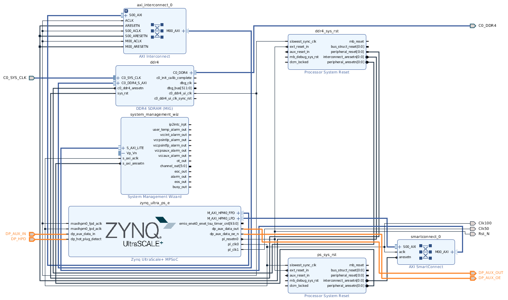
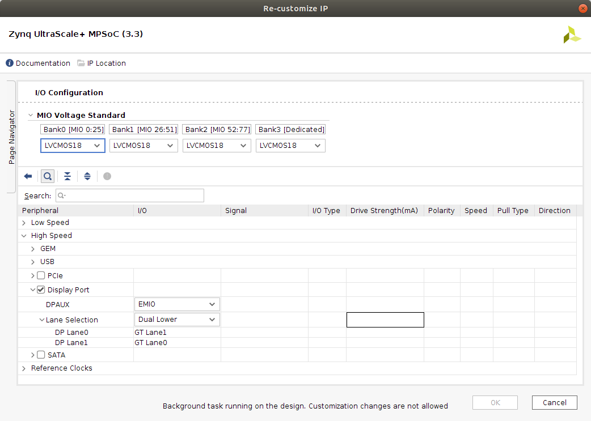
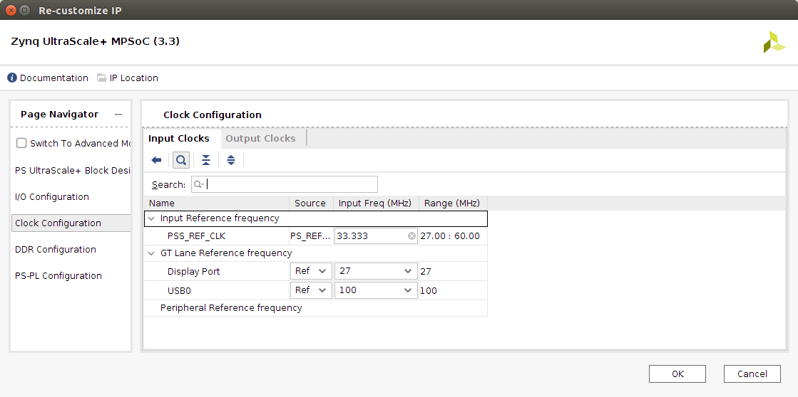
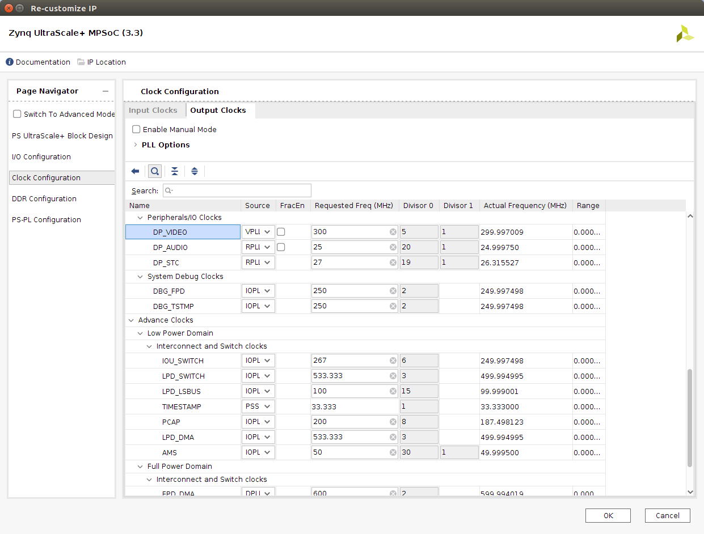
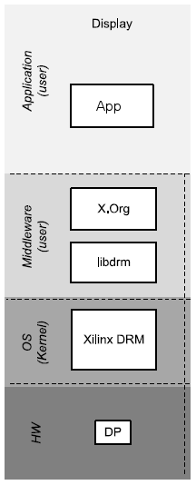

<div>
    <p><a href="https://www.enclustra.com"></a></p>
    <p style="color:white;">&nbsp;</p>
</div>


# Example 1 - DisplayPort

1. [Introduction](#introduction)
2. [Firmware Design](#firmware-design)
3. [Software Design](#software-design)
4. [Run Flow](#run-flow)
5. [FAQ](#faq)


## Introduction
The primary goal of this example is to demonstrate the basic capabilities of the DisplayPort (DP) core which is implemented as an embedded hard IP inside Zynq UltraScale+ MPSoC EV/EG devices (see [PG199] for supported features). The design uses Vivado IP Integrator (IPI) flow for building the firmware design and Xilinx Yocto PetaLinux flow for the software design.

The steps in this Application Note can be adapted to a wide range of Enclustra modules (EG and EV variants), baseboards (ST1 and ST3). For demonstration purposes and as a guide, the Enclustra [Mercury+ XU8] module and [Mercury+ ST1] baseboard are used to illustrate the necessary steps. It is based on the corresponding [Vivado reference design][XU8+ST1+RefDes] as well as [PetaLinux BSP](https://github.com/enclustra/Mercury_XU8_ST1_Reference_Design/releases/tag/2020.1_v1.1.0).

Now, what do we need to start? Additionally to the [common prerequisites](../CommonInformation.md#prerequisites), the following items are required:
* Monitor with DP
* DP-to-MiniDP cable

> ℹ **_NOTE:_**  Xilinx does not support HDMI to DP adapters, so these might not work.

> ℹ **_NOTE:_**  Not every monitor may be supported,  [here is a list of tested monitors.](https://www.xilinx.com/support/answers/68671.html)

[[Back to top]](#example-1---displayport)


## Firmware Design

> ℹ **_NOTE:_** This section describes the required modifications. A finished design which contains these modifications is available and the instructions on how to create and build the design can be found [here](../CommonInformation.md#build).

> ℹ **_NOTE:_** To trace the connections see [ST1+Schematics] and [XU8+Schematics].

The block design is quite simple, only the "Processing System" and the DP-relevant ports are of interest. These ports include the less time critical signals "Hot Plug Event" (HPD) and "Auxiliary" (AUX). AUX enables device control according to the VESA standards E-DDC, E-EDID, DDC/CI and MCCS, among others.

<p align="center"></br>Blockdesign overview</p>

Now have a look at the "I/O Configuration" of the "Zynq Ultrascale+ MPSoC" and check if the gt-lane configuration as shown figure below. The gt-lanes "GT Lane0" and "GT Lane1" are used for DP.

<p align="center"></br>I/O Configuration</p>

The same applies to the reference clock, by default a 27 MHz oscillator is connected to "RefClk3".
<p align="center"></br>Input Clocks Settings</p>

To the output clocks. A separate PLL should be used for both the video signal as well for the audio signal. E.g. to support various audio sampling rates, the clock cannot be shared between interfaces. In this example, the VPLL is used for the video and the RPLL is used for the audio (IOPPL or DPLL can also be used).

If these changes are not possible for reasons of clock accuracy or frequency requirements, the "sound card" can also be switched off in the device tree, this would be the default configuration (Enclustra BSP).

<p align="center"></br>Output Clocks Settings</p>

[[Back to top]](#example-1---displayport)


## Software Design
PetaLinux provides ease access to all configuration parameters, no matter if you use a [window-manager] (e.g. Xorg, [matchbox]), [fbcon] or a [qt-embedded] application.

But the goal here is quite simply to use the frame buffer to view a test pattern.

<p align="center"></br>Software Layers</p>

* **libdrm** provides a user space library for accessing the DRM, on operating systems that support the ioctl interface. More precisely it is a low-level library, typically used by graphics drivers such as the Mesa DRI drivers, the X drivers and similar projects. To check the functionality of the DRM/KMS driver, the tool `modetest` which is integrated in the libdrm package is used.

* The **Xilinx DRM** KMS drivers configures the display pipeline which can be integrated with multiple Xilinx Video IPs and DRM KMS compatible external IPs. E.g. the ZynqMP DisplayPort subsystem driver, ZynqMP MIPI DSI2 Tx subsystem driver, and ZynqMP SDI Tx subsystem driver are part of Xilinx DRM KMS (see [UG1221] p. 63).

### PetaLinux
What needs to be configured, where it can be found in the BSP, will now be examined in more detail.

> ℹ **_NOTE:_** Instructions for creating the ready-to-use BSP can be found **[here](../CommonInformation.md#petalinux-build)**.

All changes are already contained in the build with the pre-made BSP patch `patch/ME-XU8-7EV-2I-D12E_ST1_SD.patch`, but I invite you to review the changes and adapt them to your needs.

#### Root file system customization
To make it easier to find all the packages needed for the rootfs, simply examine the configuration file `<PetaLinux project root dir>/project-spec/configs/rootfs_config`.
* Packages for libdrm, libdrm-tests and libdrm-kms.
    ```
    CONFIG_packagegroup-petalinux-display-debug=y
    ```

#### Kernel changes
The kernel config can stay untouched. Therefore, we only have a brief look at necessary drivers.
> ℹ **_NOTE:_** The kernel configuration can only be examined after the build, since the default config is used.

* At least one framebuffer driver is required. For that, the dedicated DMA engine for DP should be enabled.
  ```
  CONFIG_XILINX_DPDMA=y
  ```
* The driver, as some other multimedia drivers, needs CMA chunk. The following config options are recommended.
  ```
  CONFIG_CMA=y
  CONFIG_DMA_CMA=y
  CONFIG_CMA_SIZE_MBYTES=256
  ```

#### Device tree changes
The following modifications were made to the device tree (see `<PetaLinux project root>/project-spec/meta-user/recipes-bsp/device-tree/files/zynqmp_enclustra_mercury_st1.dtsi`).
* `zynqmp_dpdma` - Unchanged. Enables the dp-dma.
* `zynqmp_dpsub` - Unchanged. Configured for two lanes. For more information about the parameters have a look at [DTS+DPSUB](https://github.com/Xilinx/linux-xlnx/blob/master/Documentation/devicetree/bindings/display/xlnx/xlnx,zynqmp-dpsub.txt) and [DTS+PHY](https://github.com/Xilinx/linux-xlnx/blob/xilinx-v2020.1/Documentation/devicetree/bindings/phy/phy-zynqmp.txt).
* `zynqmp_dp_snd_pcm0` - Enabled. For simplicity, audio was disabled in the BSP to leave the PLLs "untouched" (see [Firmware Design](#firmware-design)).
* `&zynqmp_dp_snd_pcm1` - Enabled.
* `zynqmp_dp_snd_card0` - Enabled.
* `zynqmp_dp_snd_codec0` - Enabled.

```dts
&xlnx_dpdma {
    status = ”okay”;
};

&zynqmp_dpsub {
    status = "okay";
    phy-names = "dp-phy0", "dp-phy1";
    phys = <&lane1 PHY_TYPE_DP 0x0 0x3 27000000>,
           <&lane0 PHY_TYPE_DP 0x1 0x3 27000000>;
    xlnx,max-lanes = <2>;
};

&zynqmp_dp_snd_pcm0 {
  status = "okay";
};

&zynqmp_dp_snd_pcm1 {
  status = "okay";
};

&zynqmp_dp_snd_card0 {
  status = "okay";
};

&zynqmp_dp_snd_codec0 {
  status = "okay";
};
```

> ℹ **_NOTE:_** Change Xilinx DRM KMS bootargs to receive more debug output [DRM+bootargs+debug][Xilinx+DRM+KMS+related+bootargs].

[[Back to top]](#example-1---displayport)


## Run Flow
1. Setup the hardware accordingly to the [Mercury+ ST1 User Manual][XU8+ST1+RefDes+Doc]. The jumpers for the correct I/O voltage and the configuration dip switch for sd card bootmode.

2. After startup, we check if everything has booted successfully.
    ```shell
    ~$ dmesg | grep -i "err\|fail"
    ```
3. Get the display information.
    ```shell
    ~$ modetest -M xlnx
    ```
    <details><summary>show</summary>

    ```shell
      Encoders:
      id      crtc    type    possible crtcs  possible clones
      41      40      TMDS    0x00000001      0x00000000

      Connectors:
      id      encoder status          name            size (mm)       modes   encoders
      42      41      connected       DP-1            530x300         28      41
        modes:
              name refresh (Hz) hdisp hss hse htot vdisp vss vse vtot)
        2560x1440 59.95 2560 2608 2640 2720 1440 1443 1448 1481 241500 flags: phsync, nvsync; type: preferred, driver
        2560x1440 30.00 2560 2680 2944 3328 1440 1441 1444 1465 146282 flags: nhsync, pvsync; type: userdef
        1920x1080 60.00 1920 2008 2052 2200 1080 1084 1089 1125 148500 flags: phsync, pvsync; type: driver
        1920x1080 60.00 1920 2008 2052 2200 1080 1084 1089 1125 148500 flags: phsync, pvsync; type: driver
        1920x1080 59.94 1920 2008 2052 2200 1080 1084 1089 1125 148352 flags: phsync, pvsync; type: driver
        1680x1050 59.95 1680 1784 1960 2240 1050 1053 1059 1089 146250 flags: nhsync, pvsync; type: driver
    ```
    </details>
4. Send a test pattern with the desired values on the crtc, 'RG16' can be replaced with any other format from primary plane.
    ```shell
    ~$ modetest -M xlnx -s 42:2560x1440@RG16

    setting mode 2560x1440-59.95Hz@RG16 on connectors 42, crtc 40
    ```
5. Enjoy

For more information have a look at [ZynqMP+DP+driver][ZynqMP+DisplayPort+Linux+driver] section "Application".

[[Back to top]](#example-1---displayport)


## FAQ
1. **Q:** Why does it fail to initialize the DP sound card?
    <details><summary>show</summary>

    ```shell
    [    3.339598] xilinx-dp-snd-codec: probe of fd4a0000.zynqmp-display:zynqmp_dp_snd_codec0 failed with error -22
    [    3.365650] xilinx-dp-snd-card fd4a0000.zynqmp-display:zynqmp_dp_snd_card: ASoC: failed to init link xilinx-dp0: -517
    [    5.323088] cpu cpu0: dev_pm_opp_set_rate: failed to find current OPP for freq 1333333320 (-34)
    [    5.340367] cpu cpu0: dev_pm_opp_set_rate: failed to find current OPP for freq 1333333320 (-34)
    [    5.428198] xilinx-dp-snd-card fd4a0000.zynqmp-display:zynqmp_dp_snd_card: ASoC: failed to init link xilinx-dp0: -517
    [    5.438953] xilinx-dp-snd-card fd4a0000.zynqmp-display:zynqmp_dp_snd_card: ASoC: failed to init link xilinx-dp0: -517
    [    5.524648] xilinx-dp-snd-card fd4a0000.zynqmp-display:zynqmp_dp_snd_card: ASoC: failed to init link xilinx-dp0: -517
    [    5.578406] xilinx-dp-snd-card fd4a0000.zynqmp-display:zynqmp_dp_snd_card: ASoC: failed to init link xilinx-dp0: -517
    [    5.611921] platform regulatory.0: Direct firmware load for regulatory.db failed with error -2
    [    5.620530] cfg80211: failed to load regulatory.db
    ```
    **A:** This is most likely related to a wrong configuration of the clocks. Please check the settings using the chapter [Firmware Design](#firmware-design).
    </details>
2. **Q:** Why does it fail to train the DP link?
    <details><summary>show</summary>

      ```shell
      [  223.042258] zynqmp-display fd4a0000.zynqmp-display: failed to configure link values
      [  223.049918] zynqmp-display fd4a0000.zynqmp-display: failed to train the DP link
      ```
      **A:** This can be caused by a series of reasons.
      1. Try another DP cable.
      2. Do not use an adpater.
      3. Check the firmware design (connections/pinout) of the DDC.
    </details>
3. **Q:** How do i get more debug messages?
    <details><summary>show</summary>

    **A:** Change Xilinx DRM KMS bootargs to receive more debug output [DRM+bootargs+debug][Xilinx+DRM+KMS+related+bootargs].
    </details>

[[Back to top]](#example-1---displayport)

[Mercury+ ST1]: https://www.enclustra.com/en/products/base-boards/mercury-st1
[Mercury+ XU8]: https://www.enclustra.com/en/products/system-on-chip-modules/mercury-xu8
[XU8+ST1+RefDes]: https://github.com/enclustra/Mercury_XU8_ST1_Reference_Design
[XU8+ST1+RefDes+Doc]: https://github.com/enclustra/Mercury_XU8_ST1_Reference_Design/blob/master/reference_design/doc/Mercury_XU8_ST1.pdf
[XU8+Schematics]: https://download.enclustra.com/public_files/SoC_Modules/Mercury+_XU8/Mercury_XU8-R2-1_User_Schematics_V3.pdf
[ST1+Schematics]: https://download.enclustra.com/public_files/Base_Boards/Mercury+_ST1/ME-ST1_User_Schematics_V4.pdf

[PG199]: https://www.xilinx.com/support/documentation/ip_documentation/dp_tx_subsystem/v2_1/pg199-displayport-tx-subsystem.pdf
[ZynqMP+DisplayPort+Linux+driver]: https://xilinx-wiki.atlassian.net/wiki/spaces/A/pages/18842105/ZynqMP+DisplayPort+Linux+driver
[Xilinx+DRM+KMS+related+bootargs]: https://xilinx-wiki.atlassian.net/wiki/spaces/A/pages/18842059/Xilinx+DRM+KMS+related+bootargs
[UG1221]: https://www.xilinx.com/support/documentation/boards_and_kits/zcu102/2020_1/ug1221-zcu102-base-trd.pdf
[UG1144]: https://www.xilinx.com/support/documentation/sw_manuals/xilinx2020_1/ug1144-petalinux-tools-reference-guide.pdf

[fbcon]: https://www.kernel.org/doc/Documentation/fb/fbcon.txt
[matchbox]: https://en.wikipedia.org/wiki/Matchbox_(window_manager)
[window-manager]: https://en.wikipedia.org/wiki/X_window_manager
[qt-embedded]: https://doc.qt.io/qt-5/embedded-linux.html#linuxfb

<br />
<div>
    <p><a href="https://www.enclustra.com"></a></p>
    <p style="color:white;">
</div>

Please visit https://www.enclustra.com for more information about our **products**, **design services** or **technical questions** and **solutions**.  
