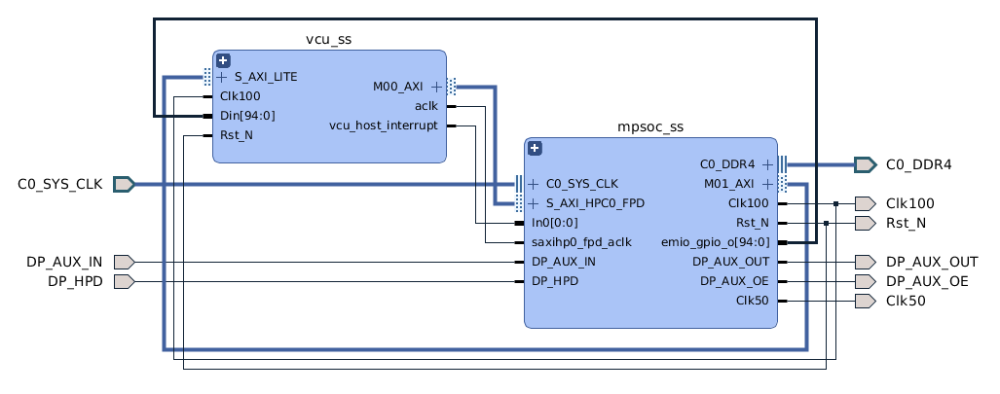
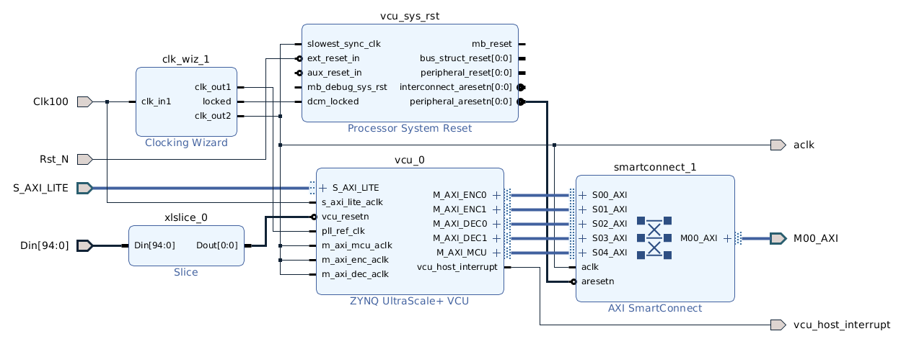
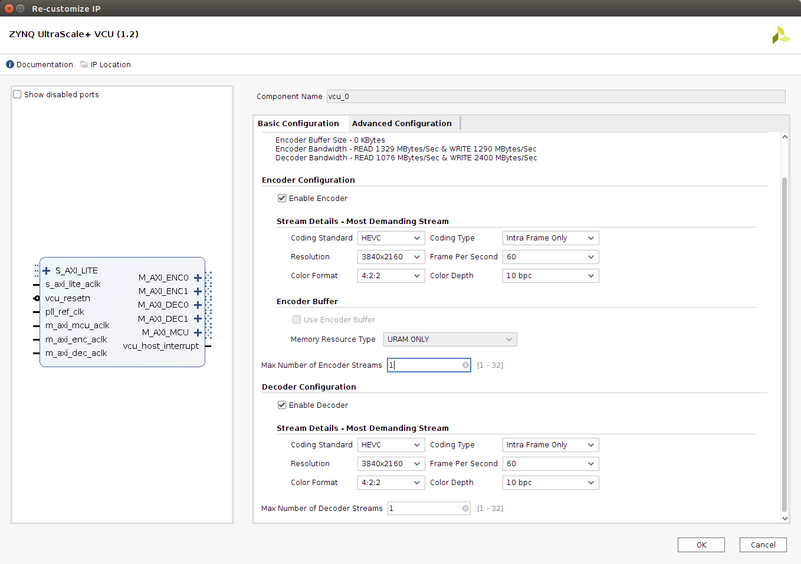
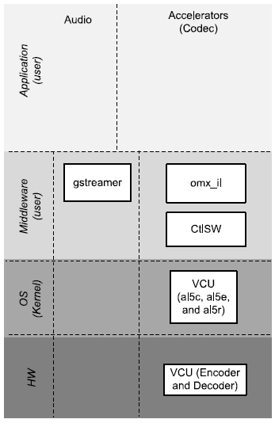
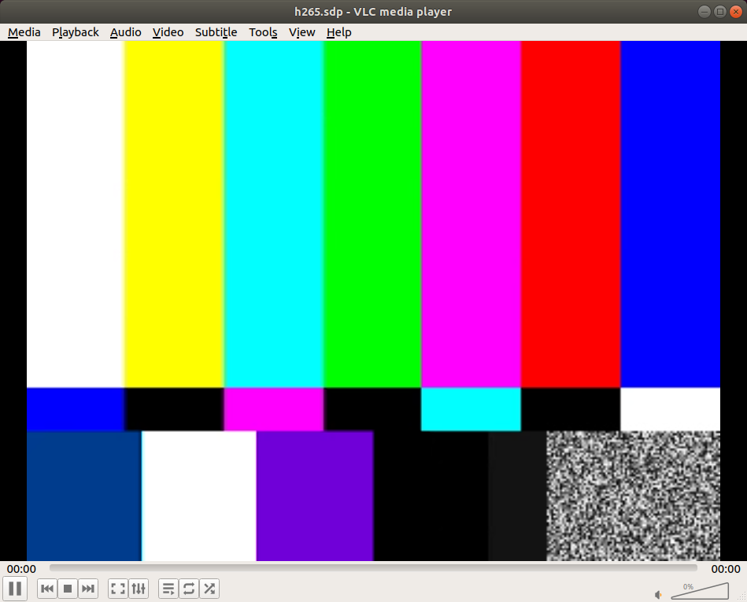

<div>
    <p><a href="https://www.enclustra.com"></a></p>
    <p style="color:white;">&nbsp;</p>
</div>

# Example 2 - Video Codec Unit

1. [Introduction](#introduction)
2. [Firmware Design](#firmware-design)
3. [Software Design](#software-design)
4. [Run Flow](#run-flow)
5. [FAQ](#faq)


## Introduction
The primary goal of this example is to demonstrate the basic capabilities of the VCU core which is implemented as an embedded hard IP inside Zynq UltraScale+ MPSoC EV devices. The design uses Vivado IP Integrator (IPI) flow for building the firmware design and Xilinx Yocto PetaLinux flow for the software design.

The steps in this Application Note can be adapted to a wide range of Enclustra modules (EG and EV variants) and baseboards (ST1 and ST3). For demonstration purposes and as a guide, the Enclustra [Mercury+ XU8] module and [Mercury+ ST1] baseboard are used to illustrate the necessary steps. It is based on the corresponding [Vivado reference design][XU8+ST1+RefDes] as well as the [PetaLinux BSP](https://github.com/enclustra/Mercury_XU8_ST1_Reference_Design/releases/tag/2020.1_v1.1.0).

Now, what do we need to start? Check the [common prerequisites](../CommonInformation.md#prerequisites).

[[Back to top]](#example-2---video-codec-unit)


## Firmware Design

> ℹ **_NOTE:_** This section describes the required modifications. A finished design which contains these modifications is available and the instructions on how to create and build the design can be found [here](../CommonInformation.md#build).

> ℹ **_NOTE:_** To trace the connections see [ST1+Schematics] and [XU8+Schematics].

The VCU is already included in the example but it could also easily be added to the blockdesign via the `Add-IP... ➞ ZYNQ UltraScale+ VCU` and `Run Block Automation`.

<p align="center"></br>Firmware Design</p>

To save as many hp ports as possible, all M_AXI connections of the VCU are looped via an single AXI SmartConnect.

<p align="center"></br>VCU Hierarchy</p>

It should instantiate the following IP-Cores and look roughly like the figure above. The design was made to run on any module equipped with an EV device. Therefore, the "AXI Register Slices" are only needed to meet the time requirements on certain slower devices. Further various clocks are needed, for AXI lite interfaces the default clock is used directly (PL0 with 100 MHz). For the memory mapped interface the clock frequency is limited to 333 MHz and has the ratio requirements stated below (see [VCU+IP+Doc]).
* `s_axi_lite_aclk ≤ 2 × m_axi_enc_aclk`
* `s_axi_lite_aclk ≤ 2 × m_axi_dec_aclk`

In addition, the frequency must be set sufficiently high depending on the desired throughput (see figure below). Since we do not bundle the axi master interfaces to a smaller number of HPx slave interfaces here we are on the safe side.

<p align="center"></br>VCU Settings</p>

If we are concerned about AXI and DDR bandwidth due to the resolution or other restrictions, we can even implement a PL-DDR interface and map it to the VCU address space. However, this is not covered here (see  [VCU+IP+Doc] P. 156 and [Hackster.io+H265] for more Information).

[[Back to top]](#example-2---video-codec-unit)


## Software Design
<p align="center"></br>Software Layers</p>

* **[GStreamer]** is great for handling video streams and modifying them and also encoding, packaging as well as broadcasting them as you like.
* **[omx_il](https://github.com/Xilinx/vcu-omx-il)** is basically an AllegroDVT2 OpenMax Integration Layer implementation that makes it available as standard GStreamer element (e.g. [allegrodvt.com](https://www.allegrodvt.com), [vcu-firmware](https://github.com/xilinx/vcu-firmware) and [vcu-modules](https://github.com/xilinx/vcu-modules)).

### PetaLinux
What needs to be configured, where it can be found in the BSP, will now be examined in more detail.

> ℹ **_NOTE:_** Instructions for creating the ready-to-use BSP can be found **[here](../CommonInformation.md#petalinux-build)**.

All changes are already contained in the build with the pre-made BSP patch `patch/ME-XU8-7EV-2I-D12E_ST1_SD.patch`, but I invite you to review the changes and adapt them to your needs.

#### Root file system customization
To make it easier to find all the packages needed for the rootfs, simply examine the configuration file `<PetaLinux project root dir>/project-spec/configs/rootfs_config`.
* Packages for Gstreamer. In more detail it includes the Gstreamer base, plugins and omx.
    ```
    CONFIG_packagegroup-petalinux-gstreamer=y
    ```
* Packages for the [V4l-utils] including yavta and media-ctl
    ```
    CONFIG_packagegroup-petalinux-v4lutils=y
    ```

#### Kernel changes
> ℹ **_NOTE:_** All kernel configuration should be set correctly by default.

#### Device tree changes
PetaLinux automatically creates the correct DTS entry for the VCU in the file `components/plnx_workspace/device-tree/device-tree/pl.dtsi`. This is not always the case and generally a plausibility test should always be performed.
* `vcu_ss_vcu_0` - For more information about the parameters have a look at [Doc+Dts+VCU].

  ```dts
  vcu_ss_vcu_0: vcu@a0000000 {
    #address-cells = <2>;
    #clock-cells = <1>;
    #size-cells = <2>;
    clock-names = "pll_ref", "aclk", "vcu_core_enc", "vcu_core_dec", "vcu_mcu_enc", "vcu_mcu_dec";
    clocks = <&misc_clk_0>, <&zynqmp_clk 71>, <&vcu_ss_vcu_0 1>, <&vcu_ss_vcu_0 2>, <&vcu_ss_vcu_0 3>, <&vcu_ss_vcu_0 4>;
    compatible = "xlnx,vcu-1.2", "xlnx,vcu";
    interrupt-names = "vcu_host_interrupt";
    interrupt-parent = <&gic>;
    interrupts = <0 89 4>;
    ranges ;
    reg = <0x0 0xa0040000 0x0 0x1000>, <0x0 0xa0041000 0x0 0x1000>;
    reg-names = "vcu_slcr", "logicore";
    reset-gpios = <&gpio 78 0>;
    encoder: al5e@a0000000 {
      compatible = "al,al5e-1.2", "al,al5e";
      interrupt-parent = <&gic>;
      interrupts = <0 89 4>;
      reg = <0x0 0xa0000000 0x0 0x10000>;
    };
  
    decoder: al5d@a0020000 {
      compatible = "al,al5d-1.2", "al,al5d";
      interrupt-parent = <&gic>;
      interrupts = <0 89 4>;
      reg = <0x0 0xa0020000 0x0 0x10000>;
    };
  };
  ```
* `misc_clk_0` - Fix entry for the pll_ref clock.

  ```dts
  misc_clk_0: misc_clk_0 {
    #clock-cells = <0>;
    clock-frequency = <33333000>;
    compatible = "fixed-clock";
  };
  ```

[[Back to top]](#example-2---video-codec-unit)


## Run Flow
1. Setup the hardware accordingly to the [Mercury+ ST1 User Manual][XU8+ST1+RefDes+Doc]. The jumpers for the correct I/O voltage and the configuration dip switch for sd card bootmode.

2. After startup, we check if everything has booted successfully.
    ```shell
    ~$ dmesg | grep -i "vcu\|al5"
    [    8.492792] xilinx-vcu xilinx-vcu: Could not get core_enc clock
    [    8.511487] VCU PLL: enable
    [    8.515733] xilinx-vcu xilinx-vcu: xvcu_probe: Probed successfully
    [    8.582819] al5d a0020000.al5d: l2 prefetch size:0 (bits), l2 color bitdepth:10
    [    8.584283] al5e a0000000.al5e: l2 prefetch size:0 (bits), l2 color bitdepth:10
    ```
    The error message "Could not get core_enc clock" can be ignored if the driver probe succeeds afterwards (see [xlnx_vcu.c](https://github.com/Xilinx/linux-xlnx/blob/master/drivers/soc/xilinx/xlnx_vcu.c#L276)).
2. To perform the network-based tests, the variables for the network addresses must be set correctly (e.g. `HOST_IP_ADDR` and `DEVICE_IP_ADDR`).
3. Further the following files video sample files are needed. If the board is connected to the network, you can execute the following shell commands directly on the target, otherwise you need the files on the SD card.
    * AVC sample file
    * HEVC sample file
    ```shell
    ~$ wget petalinux.xilinx.com/sswreleases/video-files/bbb_sunflower_2160p_30fps_normal_avc.mp4
    ~$ wget petalinux.xilinx.com/sswreleases/video-files/bbb_sunflower_2160p_30fps_normal_hevc.mkv
    ```

#### Transcode H264 to H265
```shell
~$ gst-launch-1.0 filesrc location=/home/root/bbb_sunflower_2160p_30fps_normal_avc.mp4 ! \
qtdemux name=demux demux.video_0 ! \
h264parse ! queue ! \
omxh264dec ! \
omxh265enc num-slices=8 gop-length=60 periodicity-idr=60 control-rate=low-latency target-bitrate=5000 cpb-size=3000 prefetch-buffer=false ! \
video/x-h265, profile=main,level=\(string\)6.2,tier=main ! \
queue ! \
rtph265pay ! \
filesink location=/home/root/bbb_sunflower_2160p_30fps_normal_avc.h265
```

For more information about the parameters see [gst-inspect]. It can be used to print out information about available GStreamer plugins, information about a particular plugin, or information about a particular element.

#### Sending a test pattern over the network
Execute on the sender side (device):
```shell
~$ gst-launch-1.0 videotestsrc ! \
queue ! \
omxh265enc num-slices=8 gop-length=60 periodicity-idr=60 control-rate=low-latency target-bitrate=5000 cpb-size=3000 prefetch-buffer=false ! \
video/x-h265, profile=main,level=\(string\)6.2,tier=main ! \
queue ! \
rtph265pay ! \
udpsink host=$HOST_IP_ADDR port=50000 max-lateness=-1 qos-dscp=60 async=false buffer-size=60000000 max-bitrate=120000000
```
On the receiver side, **Vlc** is utilized to view the stream. A Session Description Protocol (SDP) is needed, it describes the multimedia stream format. Create a file with the content below (e.g. h265.sdp):
```sdp
v=0 c=IN IP4 $DEVICE_IP_ADDR
m=video 50000 RTP/AVP 96
a=rtpmap:96 H265/90000
a=framerate=30
```
Start the vlc player to view the stream.
```shell
~$ vlc h265.sdp
```

Expected result:
<p align="center"></br>Test pattern</p>

#### Send a video over the network
Almost identical to the above example, except that the video test source is replaced by a file source that also needs to be decoded.
```shell
$ gst-launch-1.0 filesrc location=/home/root/bbb_sunflower_2160p_30fps_normal_avc.mp4 ! \
qtdemux name=demux demux.video_0 ! \
h264parse ! \
omxh264dec ! \
queue ! \
omxh265enc num-slices=8 gop-length=60 periodicity-idr=60 control-rate=low-latency target-bitrate=5000 cpb-size=3000 prefetch-buffer=false ! \
video/x-h265, profile=main,level=\(string\)6.2,tier=main ! \
queue ! \
rtph265pay ! \
udpsink host=$HOST_IP_ADDR port=50000 max-lateness=-1 qos-dscp=60 async=false buffer-size=60000000 max-bitrate=120000000
```

#### Sending a video from the PL to the PS and on via the network

This is described and implemented in **[Example 4 - Mobile Industry Processor Interface](../example4-mipi/Readme.md)**.


[[Back to top]](#example-2---video-codec-unit)


## FAQ
1. **Q:** What do the Gstreamer parameters mean?
    <details><summary>show</summary>

    **A:** `gst-inspect-1.0` is a tool that prints out information on available GStreamer plugins, information about a particular plugin, or information about a particular element.
    </details>
2. **Q:** The Gstreamer pipeline hangs, how can I get more debug output?
    <details><summary>show</summary>

    **A:** Gstreamer offers a variety of ways to find errors and also to measure performance, e.g.: `--gst-debug-level=5`.
    </details>

[[Back to top]](#example-2---video-codec-unit)

[Mercury+ ST1]: https://www.enclustra.com/en/products/base-boards/mercury-st1
[Mercury+ XU8]: https://www.enclustra.com/en/products/system-on-chip-modules/mercury-xu8
[XU8+ST1+RefDes]: https://github.com/enclustra/Mercury_XU8_ST1_Reference_Design
[XU8+ST1+RefDes+Doc]: https://github.com/enclustra/Mercury_XU8_ST1_Reference_Design/blob/master/reference_design/doc/Mercury_XU8_ST1.pdf
[XU8+Schematics]: https://download.enclustra.com/public_files/SoC_Modules/Mercury+_XU8/Mercury_XU8-R2-1_User_Schematics_V3.pdf
[ST1+Schematics]: https://download.enclustra.com/public_files/Base_Boards/Mercury+_ST1/ME-ST1_User_Schematics_V4.pdf

[UG1144]: https://www.xilinx.com/support/documentation/sw_manuals/xilinx2020_1/ug1144-petalinux-tools-reference-guide.pdf
[VCU+IP+Doc]: https://www.xilinx.com/support/documentation/ip_documentation/vcu/v1_2/pg252-vcu.pdf
[VCU+Product]: https://www.xilinx.com/products/intellectual-property/v-vcu.html
[VCU+TRD+2020.1]: https://xilinx-wiki.atlassian.net/wiki/spaces/A/pages/460948332/Zynq+UltraScale+MPSoC+VCU+TRD+2020.1
[VCU+TRD+Multi+Stream+2020.1]: https://xilinx-wiki.atlassian.net/wiki/spaces/A/pages/541786229/Zynq+UltraScale+MPSoC+VCU+TRD+2020.1+-+VCU+TRD+Multi+Stream
[Xilinx+V4L2+TPG]: https://xilinx-wiki.atlassian.net/wiki/spaces/A/pages/18841638/Xilinx+V4L2+TPG+driver
[Xilinx+Zynq+UltraScale+MPSoC+VCU]: https://xilinx-wiki.atlassian.net/wiki/spaces/A/pages/18842546/Xilinx+Zynq+UltraScale+MPSoC+Video+Codec+Unit
[Xilinx+Arm+Mali-400+Driver]: https://xilinx-wiki.atlassian.net/wiki/spaces/A/pages/18841928/Xilinx+Arm+Mali-400+Driver
[Doc+Dts+VCU]: https://github.com/Xilinx/linux-xlnx/blob/master/Documentation/devicetree/bindings/soc/xilinx/xlnx,vcu.txt
[ZynqMP+DisplayPort+Linux+driver]: https://xilinx-wiki.atlassian.net/wiki/spaces/A/pages/18842105/ZynqMP+DisplayPort+Linux+driver

[V4l-utils]: https://www.linuxtv.org/wiki/index.php/V4l-utils
[GStreamer]: https://gstreamer.freedesktop.org/
[gst-inspect]: https://gstreamer.freedesktop.org/documentation/tools/gst-inspect.html?gi-language=c
[Hackster.io+H265]: https://www.hackster.io/news/microzed-chronicles-a-look-at-the-zynq-mpsoc-ev-h-265-video-codec-f076c6eca94a

<br />
<div>
    <p><a href="https://www.enclustra.com"></a></p>
    <p style="color:white;">
</div>

Please visit https://www.enclustra.com for more information about our **products**, **design services** or **technical questions** and **solutions**.  
