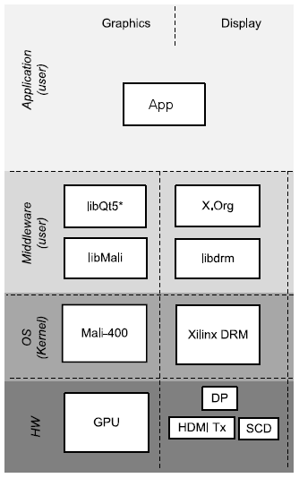

<div>
    <p><a href="https://www.enclustra.com"></a></p>
    <p style="color:white;">&nbsp;</p>
</div>


# Example 3 - GPU - Mali-400

1. [Introduction](#introduction)
2. [Firmware Design](#firmware-design)
3. [Software Design](#software-design)
4. [Run Flow](#run-flow)
5. [FAQ](#faq)


## Introduction
The ARM MALI 400MP is an OpenGLES 2.0 capable GPU. OpenGLES 2.0 was the first portable mobile graphics API to provide programmable shaders in the then latest generation of graphics hardware. It still remains the most widely used 3D graphics API and a solid choice.

The primary goal of this example is to demonstrate the utilization of the GPU core which is an integrated hard block present in Zynq UltraScale+ MPSoC EV devices. The design uses Vivado IP Integrator (IPI) flow for building the hardware design and Xilinx Yocto PetaLinux flow for software design. It uses Xilinx IPs and software drivers to demonstrate the capabilities of different components.

The steps in this Application Note can be adapted to a wide range of Enclustra modules (EG and EV variants), baseboards (ST1 and ST3). For demonstration purposes and as a guide, the Enclustra [Mercury+ XU8] module and [Mercury+ ST1] baseboard are used to illustrate the necessary steps. It is based on the corresponding [Vivado reference design][XU8+ST1+RefDes] as well as PetaLinux BSP.

We'll use the DisplayPort (DP) to visualize OpenGL ES 2.0 applications.

Now, what do we need to start? Additionally, to the [common prerequisites](../CommonInformation.md#prerequisites), the following items are recommended:
* USB-Hub
* Mouse
* Keyboard


[[Back to top]](#example-3---gpu---mali-400)


## Firmware Design
The block design is very simple and it basically consist only of the the ”Processing System” and the ports used for the DP (see [Example1-DP](../example1-dp/Readme.md#firmware-design)).

[[Back to top]](#example-3---gpu---mali-400)


## Software Design
The driver for MALI 400MP consists of Linux kernel driver and user library. The user space library is proprietary licensed and gets distributed as binaries by Xilinx. The user space library are provided through Xilinx PetaLinux (see https://github.com/Xilinx/mali-userspace-binaries). The Linux kernel driver is GPL licensed and is downloaded from the ARM website http://malideveloper.arm.com and packaged directly into the PetaLinux BSP (see [PetaLinux+SDK+Licensing](https://www.xilinx.com/products/design-tools/embedded-software/petalinux-sdk.html#licensing)).

<p align="center"></br>Software Layers</p>

Have a look at the the [Mali-400 specification](https://developer.arm.com/ip-products/graphics-and-multimedia/mali-gpus/mali-400-gpu).

> ℹ **_NOTE:_** OpenCL is not supported.

> ℹ **_NOTE:_** OpenGL for GPGPU workloads is possible, but OpenGL ES 2.0 has many limitations.

> ℹ **_NOTE:_** Only "mediump" fp16 (and not IEEE fp16 at that) processing precision.

 > ℹ **_NOTE:_** only ability to output data is via image framebuffer output (e.g. render to texture), so you'll need to map your output data set in to RGBA8 color data and store it into a texture which can be read back on to the CPU.

### PetaLinux
What needs to be configured, where it can be found in the BSP, will now be examined in more detail.

> ℹ **_NOTE:_** Instructions to create the BSP can be found **[here](../CommonInformation.md#petalinux-build)**.

All changes are already contained in the build with the pre-made BSP patch `patch/ME-XU8-7EV-2I-D12E_ST1_SD.patch`, but I invite you to review the changes and adapt them to your needs.

#### Root file system customization
To make it easier to find all the packages needed for the rootfs, simply examine the configuration file `<PetaLinux project root dir>/project-spec/configs/rootfs_config`.
* Packages for libdrm, libdrm-tests and libdrm-kms.
    ```
    CONFIG_packagegroup-petalinux-display-debug=y
    ```
* The Mali400 libraries.
    ```
    CONFIG_libmali-xlnx=y
    CONFIG_libmali-xlnx-dev=y
    ```
* A suitable window manager (see [Xil+Arm+Mali-400+Driver]).
    ```
    CONFIG_packagegroup-petalinux-x11=y
    ```
* Add the package group for Qt which includes its examples. E.g the hellogl2 OpenGl ES 2.0 example (see https://doc.qt.io/qt-5/qtopengl-hellogl2-example.html).
    ```
    CONFIG_packagegroup-petalinux-qt=y
    ```

#### Kernel changes
> ℹ **_NOTE:_** No changes needed.

Like mentioned above, the Linux kernel drivers are contained the PetaLinux BSP.

#### Device tree
> ℹ **_NOTE:_** No changes needed.

The DT binding documentation is included in the driver release. Download the kernel driver tarball from [Mali+Drivers], unzip it and the DT binding documentation is available at the folder path `"driver/documentation/devicetree/bindings/arm/mali-utgard.txt"`.

[[Back to top]](#example-3---gpu---mali-400)


## Run Flow
1. Setup the hardware accordingly to the [Mercury+ ST1 User Manual][XU8+ST1+RefDes+Doc]. The jumpers for the correct I/O voltage and the configuration dip switch for sd card boot mode.

2. After startup, we check if everything has booted successfully.
    ```shell
    ~$ dmesg | grep -i "error\|fail"
    ```

#### Run prebuilt example
1. Restart the X11 session and export the display system variable.
```shell
~$ killall Xorg
~$ export DISPLAY=:0.0
~$ /usr/bin/Xorg -depth 16&
```
2. Navigate to the folder with the QT examples and start a sample application of your choice via console.
```shell
~$ cd /usr/share/examples/opengl/
~$ ./hellowindow/hellowindow
```
Now, you should see the Qt application on the monitor.

<p align="center"></br>Screenshot example hellowindow</p>

3. Connect the mouse to the target and move the graphical object with it.

####  Create and integrate your own application

There are already a lot of examples of this, have a look at the `tricube` example of Avnet which can be found on [GitHub](https://github.com/Avnet/petalinux/blob/master/configs/meta-user/uz3eg_iocc_dp/recipes-apps/trd-files/files).

#### Possibly of interest
Some more advanced topic can be found in the Xilinx Wiki:
 * [Zynq UltraScale＋MPSoC Graphics- GPU application debugging using ARM Mali Graphics Debugger tool](https://xilinx-wiki.atlassian.net/wiki/spaces/A/pages/18842087/Zynq+UltraScale+MPSoC+Graphics-+GPU+application+debugging+using+ARM+Mali+Graphics+Debugger+tool)
 * [Zynq UltraScale＋MPSoC Graphics- GPU Profiling using ARM Streamline performance analyzer](https://xilinx-wiki.atlassian.net/wiki/spaces/A/pages/18842153/Zynq+UltraScale+MPSoC+Graphics-+GPU+Profiling+using+ARM+Streamline+performance+analyzer)

[[Back to top]](#example-3---gpu---mali-400)


## FAQ

[[Back to top]](#example-3---gpu---mali-400)


[Mercury+ ST1]: https://www.enclustra.com/en/products/base-boards/mercury-st1
[Mercury+ XU8]: https://www.enclustra.com/en/products/system-on-chip-modules/mercury-xu8
[XU8+ST1+RefDes]: https://github.com/enclustra/Mercury_XU8_ST1_Reference_Design/tree/2020.1_v1.0.0
[XU8+ST1+RefDes+Doc]: https://github.com/enclustra/Mercury_XU8_ST1_Reference_Design/blob/master/reference_design/doc/Mercury_XU8_ST1.pdf
[XU8 Schematics]: https://download.enclustra.com/public_files/SoC_Modules/Mercury+_XU8/Mercury_XU8-R2-1_User_Schematics_V3.pdf
[ST1+Schematics]: https://download.enclustra.com/public_files/Base_Boards/Mercury+_ST1/ME-ST1_User_Schematics_V4.pdf

[Xil+Arm+Mali-400+Driver]: https://xilinx-wiki.atlassian.net/wiki/spaces/A/pages/18841928/Xilinx+Arm+Mali-400+Driver
[UG1209]: https://www.xilinx.com/support/documentation/sw_manuals/xilinx2020_1/ug1209-embedded-design-tutorial.pdf
[UG1144]: https://www.xilinx.com/support/documentation/sw_manuals/xilinx2020_1/ug1144-petalinux-tools-reference-guide.pdf
[Mali+Drivers]: https://developer.arm.com/tools-and-software/graphics-and-gaming/mali-drivers


<br />
<div>
    <p><a href="https://www.enclustra.com"></a></p>
    <p style="color:white;">
</div>

Please visit https://www.enclustra.com for more information about our **products**, **design services** or **technical questions** and **solutions**.  
