<div>
    <p><a href="https://www.enclustra.com"></a></p>
    <p style="color:white;">&nbsp;</p>
</div>


# Example 4 - MIPI - CSI-2

1. [Introduction](#introduction)
2. [Firmware Design](#firmware-design)
3. [Software Design](#software-design)
4. [Run Flow](#run-flow)
5. [FAQ](#faq)


## Introduction
Mobile Industry Processor Interface (MIPI) is an embedded display interface, comparable to LVDS and eDP. The MIPI interface was specified by the MIPI Alliance, a manufacturer-independent alliance of well-known mobile communications companies (see [MIPI CSI Specification]). For the MIPI interface, the MIPI Alliance specified the Camera Parallel Interface (CPI) for image sensors and camera modules and the Camera Serial Interface (CSI). The latter in the three versions MIPI-CSI1, MIPI-CSI2 and MIPI-CSI3.

The primary goal of this example is to demonstrate how to receive data from the IMX219 sensor of a Rasperry PI camera, perform minimal video processing on it to optimize the image, and transmit the video stream to the CPU. With the video stream in the CPU, all options are then open: saving, displaying, or sending it via the network.

The MIPI interface consists of up to four lanes (the IMX219 uses two), each of which is formed by a differential twin wire. The data can be transferred via these lanes in low-power mode (LP) with a lower data rate or in high-speed mode (HS) with a high data rate. The MIPI interface supports high resolution for displays and cameras up to 2K, 4K, 8K and beyond video, and high-resolution photography.

The Xilinx UltraScale+ MPSoC-s, including the XCZU7EV-1FBVB900E used in the [ME-XU8-7EV-2I-D12E][Mercury+ XU8] module, supports differential signaling. On the [Mercury+ ST1], these are routed to two high-speed connectors, which can be used as both MIPI CSI-2.

The steps in this Application Note can be adapted to a wide range of Enclustra modules (EG and EV variants), baseboards (ST1 and ST3). For demonstration purposes and as a guide, the Enclustra [Mercury+ XU8] module and [Mercury+ ST1] baseboard are used to illustrate the necessary steps. It is based on the corresponding [Vivado reference design][XU8+ST1+RefDes] as well as the PetaLinux BSP.

Now, what do we need to start? Additionally, to the [common prerequisites](../CommonInformation.md#prerequisites), the following items are required:
* Raspberry Pi - Camera, 8MP, v2.1, IMX219PQ ([IMX219 Datasheet], [IMX219 Pinout])
* Crossed flat ribbon cable

[[Back to top]](#example-4---mobile-industry-processor-interface)

## Firmware Design

The ST1 baseboard allows to receive the LP and HS signals via a resistor network (see figure 11 [xapp894-d-phy-solutions]).

> ℹ **_NOTE:_** Instructions on how to create and build the design can be found [here](../CommonInformation.md#firmware-build).

> ℹ **_NOTE:_** To "trace" the connections see [ST1 Schematics] and [XU8 Schematics].

For a better overview all "areas" were divided and packed into a their respective hierarchy.
<p align="center">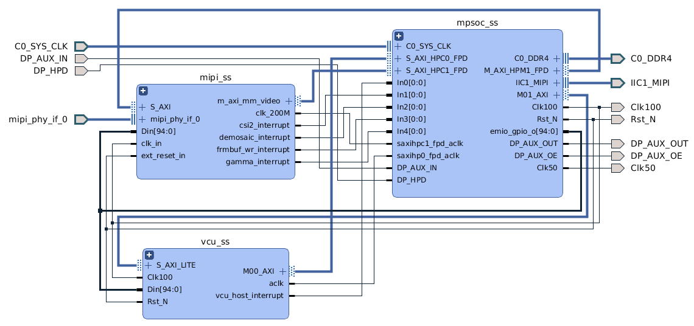</br>Blockdesign overview</p>

Let's take a closer look at the mipi_ss hierarchy. The video data path from the "mipi_phy" to the video frame buffer and thus to the memory mapped interface of the PS is marked orange. Furthermore, the "clock_wiz_0" provides a 200 MHz clock for all interfaces (AXI, AXIS, DPHY) and cores.
<p align="center">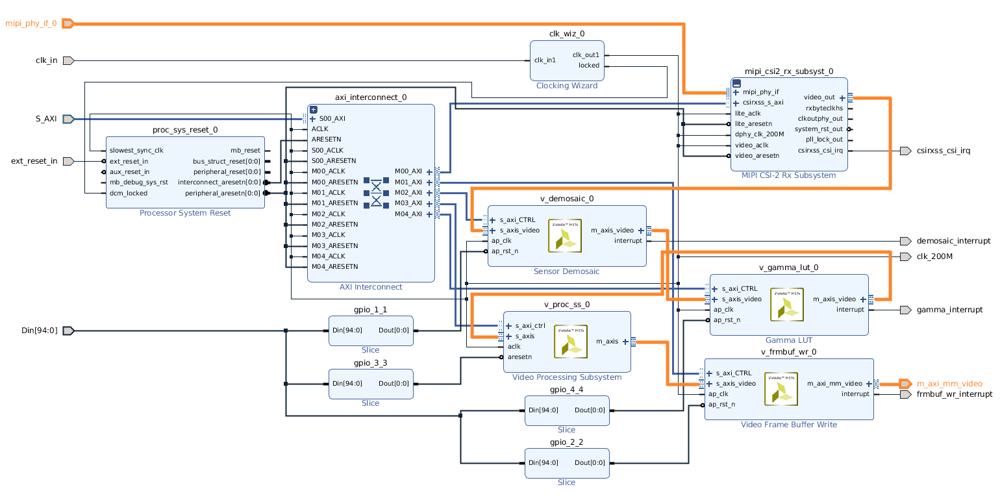</br>Blockdesign MIPI hierarchy</p>

The MIPI CSI2 RX Subsystem implements a CSI-2 receive interface according to the MIPI CSI-2 standard. Important are the two serial data lines and since the IMX219 can only be operated with 8 or 10 bits, 8 bits are explicitly used here. Vivado automatically limits the line rates based on the selected device, but 800 MBps should be sufficient for all use cases. More information can be found on page 54 and following in the [MIPI CSI2 RX] product guide.
<p align="center">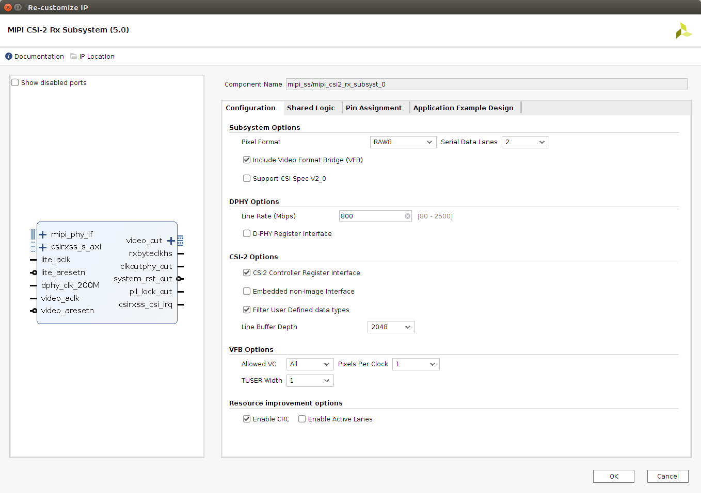</br>Settings Video Frame Buffer Read</p>

We want a simple solution and don't want to fine-tune it here or share it outside of the mipi core, hence "Include Share Logic in core" is selected.
<p align="center">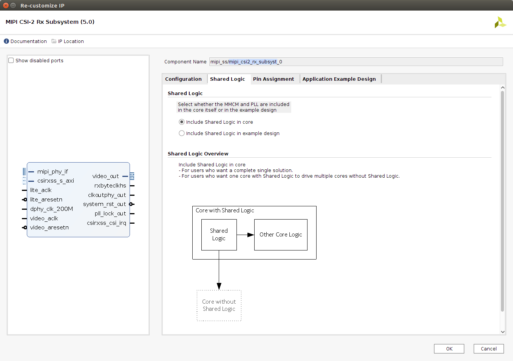</br>MIPI Settings</p>

The pin assignment takes place directly in the MIPI core and was therefore removed from the constraint file by the reference design patch (`<path-to-your-refdes>/scripts/Mercury_XU8_ST1.tcl`). As already mentioned, a maximum of two lanes are available.
<p align="center">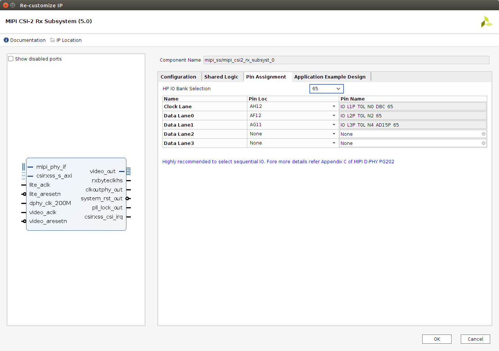</br>MIPI Settings</p>

The [Sensor Demosaic (1.0)] provides an optimized hardware block that reconstructs sub-sampled color data for images captured by a Bayer image sensor (e.g. [bayer filter](https://en.wikipedia.org/wiki/Bayer_filter), [chroma subsampling](https://en.wikipedia.org/wiki/Chroma_subsampling)). To improve the resulting video image, we have selected "Fringe Tolerant Interpolation" for slightly softer images with suppression of color fringing artifacts. This is recommended for low cost optics. Furthermore, the "Horizontal Zipper Artifact Removal" is selected as post processing smoothing filter to soften the output image.
<p align="center">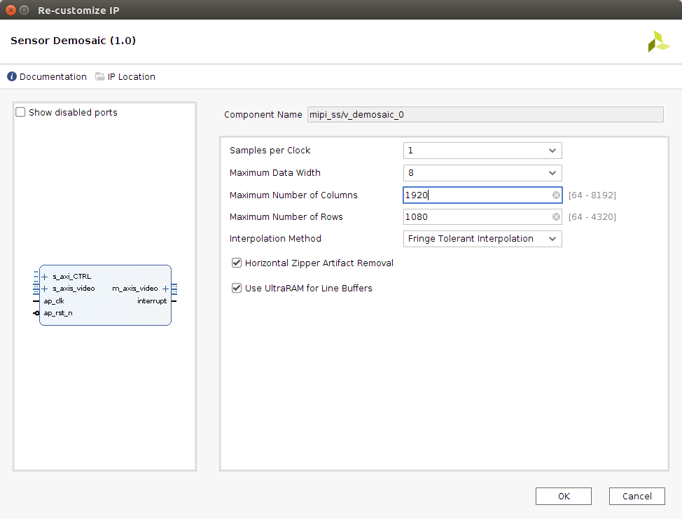</br>Demosaic Settings</p>

The [Gamma LUT (1.0)] provides an optimized hardware block for manipulating the red, green and blue color values (e.g. [gamma correction](https://en.wikipedia.org/wiki/Gamma_correction)). Note that this core is not essential.
<p align="center">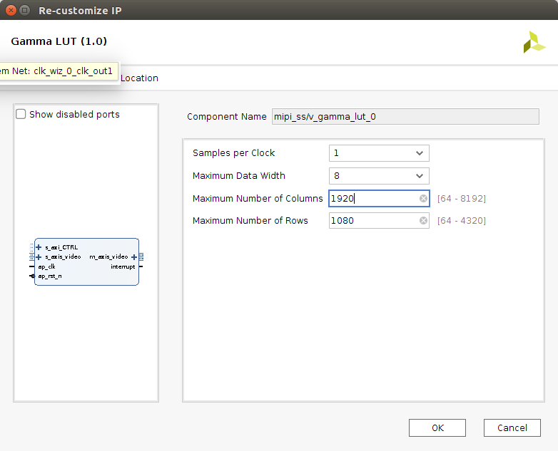</br>Gamma LUT Settings</p>

The [Video Processing Sybsystem (2.2)] is a collection of video processing IP subcores, bundled together in hardware and software, abstracting the video processing pipe. This is operated in color space conversion only mode. As we will see later, the VCU only supported certain color space format, more precisely it needs "YUV 4:2:0", so this format must be included. Note that this core is not mandatory and can be removed if you do not plan to change the color space format or use the VCU. But depending on your camera it could be that the resolution is not supported and therefore you need this core to crop the image or another VPSS in "scaler only mode".
<p align="center">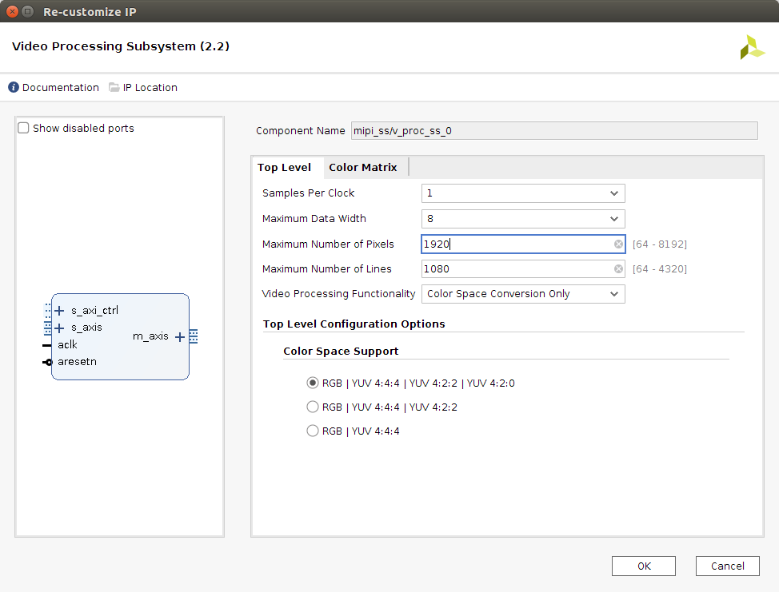</br>VPSS Settings</p>

The [Video Frame Buffer Write] core provides high-bandwidth direct memory access between memory and AXI4-Stream video peripherals. In short, the transfer of the images to the PS is done via memory.
<p align="center">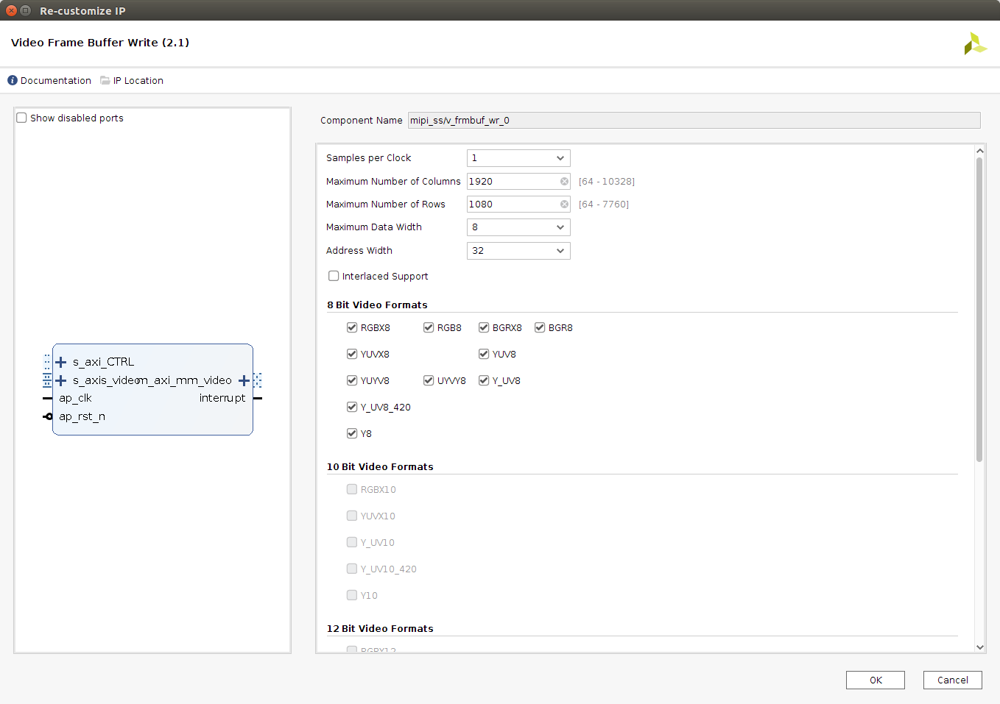</br>Frame Buffer Write Settings</p>

[[Back to top]](#example-4---mobile-industry-processor-interface)

## Software Design
<p align="center">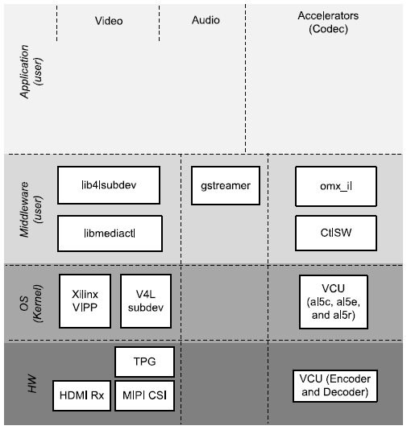</br>Software Layers</p>

* **[V4L]** is basically a collection of device drivers and an API for supporting realtime video handling on Linux systems. A good reference is the Xilinx Wiki (see [Xilinx V4L2 driver]).
 * **[V4L-utils]** contains all the user space libraries and tools (e.g. libv4lsubdev, libmediactl).
 * **[V4L-Api]** which builds the base for the drivers especially [V4L-Api-subdev] and [V4L-Api-mediactl].
* **[GStreamer]** is great for handling video streams and modifying them and also encoding, packaging as well as sending them as you like.
* **[omx_il]** is basically an AllegroDVT2 OpenMax Integration Layer implementation wrapper plugin that makes it available as standard GStreamer elements (see [allegrodvt.com], [vcu-firmware] and [vcu-modules]).

### PetaLinux
What needs to be configured, where it can be found in the BSP, will now be examined in more detail.

> ℹ **_NOTE:_** Instructions for creating the ready-to-use BSP can be found **[here](../CommonInformation.md#petalinux-build)**.

All changes are already contained in the build with the premade BSP patch `patch/ME-XU8-7EV-2I-D12E_ST1_SD.patch`, but I invite you to review the changes and adapt them to your needs.

#### Root file system customization
To make it easier to find all the packages needed for the rootfs, simply examine the configuration file `<PetaLinux project root dir>/project-spec/configs/rootfs_config`.
* Packages for Gstreamer. In more detail it includes the Gstreamer base, plugins and omx.
    ```
    CONFIG_packagegroup-petalinux-gstreamer=y
    ```
* Packages for the [V4L-utils] including yavta and media-ctl
    ```
    CONFIG_packagegroup-petalinux-v4lutils=y
    ```

#### Kernel changes
For the Raspberry Pi camera or better the IMX219 sensor there is no driver available out of the box. A matching driver has to be taken from the Raspberry Pi repository (see [IMX219 Driver]).

* For this to be compiled, integrated and enabled an additional config flag is needed.
  ```
  CONFIG_VIDEO_IMX219=y
  ```

#### Device tree changes
The following modifications were made to the device tree (see `<PetaLinux project root dir>/project-spec/meta-user/recipes-bsp/device-tree/files/pl-custom.dtsi`). Some nodes for the PL, which are automatically generated by PetaLinux, are partly incorrect and have to be changed (e.g. compatible strings, missing resets, etc.). See the device tree overlay below.

Furthermore, it is important to know that the entire pipeline must be mapped not only in the firmware but also in the device tree. All nodes are linked "bidirectionally", the correct pixel format should be set at the interfaces (see [Xilinx V4L2 driver]).
* `imx219` - V4L2 subdevice (see `<Kernel root dir>/Documentation/devicetree/bindings/media/i2c/imx219.yaml`).

    ```dts
    &i2c1 {
      #address-cells = <1>;
      #size-cells = <0>;
      imx219: sensor@10 {
        compatible = "sony,imx219";
        reg = <0x10>;
        clocks = <&imx219_clk>;
        clock-names = "xclk";

        imx219_clk: camera-clk {
          compatible = "fixed-clock";
          #clock-cells = <0>;
          clock-frequency = <24000000>;
        };

        port {
          imx219_to_mipi_csi2: endpoint {
            remote-endpoint = <&mipi_csi2_from_imx219>;
            clock-lanes = <0>;
            data-lanes = <1 2>;
            clock-noncontinuous;
            link-frequencies = /bits/ 64 <456000000>;
          };
        };
      };
    };
    ```
* `mipi_ss_mipi_csi2_rx_subsyst_0` - V4L2 subdevice (see [DTS+CSI2], [xilinx-vip.c], [xilinx-csi2rxss.c]).

    ```dts
    &mipi_ss_mipi_csi2_rx_subsyst_0 {
      ports {
        #address-cells = <1>;
        #size-cells = <0>;
        port@0 {
          reg = <0>;
          xlnx,cfa-pattern = "rggb";
          xlnx,video-format = <XVIP_VF_MONO_SENSOR>;
          xlnx,video-width = <8>;
          mipi_csi2_to_demosaic: endpoint {
            remote-endpoint = <&demosaic_from_mipi_csi2>;
          };
        };
        port@1 {
          reg = <1>;
          xlnx,cfa-pattern = "rggb";
          xlnx,video-format = <XVIP_VF_MONO_SENSOR>;
          xlnx,video-width = <8>;
          mipi_csi2_from_imx219: endpoint {
            data-lanes = <1 2>;
            remote-endpoint = <&imx219_to_mipi_csi2>;
          };
        };
      };
    };
    ```
* `mipi_ss_v_demosaic_0` - V4L2 subdevice (see [DTS+Demosaic]).

  <pre>
  &mipi_ss_v_demosaic_0 {
    <b>compatible = "xlnx,v-demosaic";</b>
    <b>reset-gpios = <&gpio 79 GPIO_ACTIVE_LOW>;</b>
    xlnx,max-width = <1920>;
    xlnx,max-height = <1080>;
    ports {
      #address-cells = <1>;
      #size-cells = <0>;
      port@0 {
        reg = <0>;
        xlnx,video-width = <8>;
        demosaic_from_mipi_csi2: endpoint {
          remote-endpoint = <&mipi_csi2_to_demosaic>;
        };
      };
      port@1 {
        reg = <1>;
        xlnx,video-width = <8>;
        demosaic_to_gamma: endpoint {
          remote-endpoint = <&gamma_from_demosaic>;
        };
      };
    };
  };
  </pre>
* `mipi_ss_v_gamma_lut_0` - V4L2 subdevice (see [DTS+LUT]).

  <pre>
  &mipi_ss_v_gamma_lut_0 {
    <b>compatible = "xlnx,v-gamma-lut";</b>
    <b>reset-gpios = <&gpio 82 GPIO_ACTIVE_LOW>;</b>
    ports {
      #address-cells = <1>;
      #size-cells = <0>;
      port@0 {
        reg = <0>;
        xlnx,video-width = <8>;
        gamma_from_demosaic: endpoint {
          remote-endpoint = <&demosaic_to_gamma>;
        };
      };
      port@1 {
        reg = <1>;
        xlnx,video-width = <8>;
        gamma_to_scaler: endpoint {
          remote-endpoint = <&scaler_from_gamma>;
        };
      };
    };
  };
  </pre>
* `mipi_ss_v_proc_ss_0` - V4L2 subdevice (see [DTS+CSC]). Special is that the driver only wanted to load correctly with the video format `XVIP_VF_YUV_422`. However, after successful initialization it was also possible to use other formats.

  <pre>
  &mipi_ss_v_proc_ss_0 {
    <b>compatible = "xlnx,v-vpss-csc";</b>
    <b>reset-gpios = <&gpio 81 GPIO_ACTIVE_LOW>;</b>
    ports {
      #address-cells = <1>;
      #size-cells = <0>;
      port@0 {
        reg = <0>;
        xlnx,video-format = <XVIP_VF_YUV_422>;
        xlnx,video-width = <8>;
        scaler_from_gamma: endpoint {
          remote-endpoint = <&gamma_to_scaler>;
        };
      };
      port@1 {
        reg = <1>;
        xlnx,video-format = <XVIP_VF_YUV_422>;
        xlnx,video-width = <8>;
        scaler_to_vcap: endpoint {
          remote-endpoint = <&vcap_from_scaler>;
        };
      };
    };
  };
  </pre>
* `mipi_ss_v_frmbuf_wr_0` - Correction of the reset and the compatible string.

  <pre>
  &mipi_ss_v_frmbuf_wr_0 {
    <b>compatible = "xlnx,axi-frmbuf-wr-v2.1";</b>
    <b>reset-gpios = <&gpio 80 GPIO_ACTIVE_LOW>;</b>
  };
  </pre>
* `vcap0` - VIPP top level node of the pipeline which defines mappings between DMA and the video IP core (see [DTS+Video]).

  ```dts
  &amba_pl {
    vcap0: video_cap {
      compatible = "xlnx,video";
      dmas = <&mipi_ss_v_frmbuf_wr_0 0>;
      dma-names = "port0";
      ports {
        #address-cells = <1>;
        #size-cells = <0>;
        port@0 {
          reg = <0>;
          direction = "input";
          vcap_from_scaler: endpoint {
            remote-endpoint = <&scaler_to_vcap>;
          };
        };
      };
    };
  };
  ```


## Run Flow
1. Setup the hardware accordingly to the [Mercury+ ST1 User Manual][XU8+ST1+RefDes+Doc]. The jumpers for the correct I/O voltage and the configuration dip switch for sd-card boot mode.

2. To perform the network-based tests, the variable for the network addresses must be set correctly (`HOST_IP_ADDR`).

3. Check and iterate the V4L2 subdevices.
    ```shell
    ~$ media-ctl -p
    ```
    <details><summary>show more</summary>

    ```shell
    Media controller API version 5.4.0

    Media device information
    ------------------------
    driver          xilinx-video
    model           Xilinx Video Composite Device
    serial          
    bus info        
    hw revision     0x0
    driver version  5.4.0

    Device topology
    - entity 1: video_cap output 0 (1 pad, 1 link)
                type Node subtype V4L flags 0
                device node name /dev/video0
            pad0: Sink
                    <- "b0010000.v_proc_ss":1 [ENABLED]

    - entity 5: imx219 1-0010 (1 pad, 1 link)
                type V4L2 subdev subtype Sensor flags 0
                device node name /dev/v4l-subdev0
            pad0: Source
                    [fmt:SRGGB10_1X10/3280x2464 field:none colorspace:srgb xfer:srgb ycbcr:601 quantizati]
                    -> "b0000000.mipi_csi2_rx_subsystem":1 [ENABLED]

    - entity 7: b0000000.mipi_csi2_rx_subsystem (2 pads, 2 links)
                type V4L2 subdev subtype Unknown flags 0
                device node name /dev/v4l-subdev1
            pad0: Source
                    [fmt:SRGGB8_1X8/1920x1080 field:none colorspace:srgb]
                    -> "b0020000.v_demosaic":0 [ENABLED]
            pad1: Sink
                    [fmt:SRGGB8_1X8/1920x1080 field:none colorspace:srgb]
                    <- "imx219 1-0010":0 [ENABLED]

    - entity 10: b0020000.v_demosaic (2 pads, 2 links)
                 type V4L2 subdev subtype Unknown flags 0
                 device node name /dev/v4l-subdev2
            pad0: Sink
                    [fmt:SRGGB8_1X8/1280x720 field:none colorspace:srgb]
                    <- "b0000000.mipi_csi2_rx_subsystem":0 [ENABLED]
            pad1: Source
                    [fmt:RBG888_1X24/1280x720 field:none colorspace:srgb]
                    -> "b0040000.v_gamma_lut":0 [ENABLED]

    - entity 13: b0040000.v_gamma_lut (2 pads, 2 links)
                 type V4L2 subdev subtype Unknown flags 0
                 device node name /dev/v4l-subdev3
            pad0: Sink
                    [fmt:RBG888_1X24/1280x720 field:none colorspace:srgb]
                    <- "b0020000.v_demosaic":1 [ENABLED]
            pad1: Source
                    [fmt:RBG888_1X24/1280x720 field:none colorspace:srgb]
                    -> "b0010000.v_proc_ss":0 [ENABLED]

    - entity 16: b0010000.v_proc_ss (2 pads, 2 links)
                 type V4L2 subdev subtype Unknown flags 0
                 device node name /dev/v4l-subdev4
            pad0: Sink
                    [fmt:UYVY8_1X16/1280x720 field:none colorspace:rec709]
                    <- "b0040000.v_gamma_lut":1 [ENABLED]
            pad1: Source
                    [fmt:UYVY8_1X16/1280x720 field:none colorspace:rec709]
                    -> "video_cap output 0":0 [ENABLED]
    ```
    </details>

    If nodes are missing you may want to check `dmesg` for any errors.
    ```shell
    ~$ dmesg | grep "fail\|err\|demo"
    ```

4. Initialize all the sub-devices. You can simply use the following shell commands to initialize the V4L2 subdevice with the correct values. There are currently two possible resolutions supported by the driver (e.g. `1920x1080` and `640x480`).
    ```shell
    export x=1920
    export y=1080

    export fmt=SRGGB8_1X8/${x}x${y}
    export fmt_demosaic_out=RBG24/${x}x${y}
    export fmt_scaler_out=UYVY/${x}x${y}

    echo "init image sensor"
    media-ctl --set-v4l2 "'imx219 1-0010':0[fmt:$fmt field:none]"
    yavta --no-query -w '0x009f0905 4095' /dev/v4l-subdev0

    echo "init mipi core"
    media-ctl --set-v4l2 "'b0000000.mipi_csi2_rx_subsystem':0[fmt:$fmt field:none]"

    echo "init demosaic"
    media-ctl --set-v4l2 "'b0020000.v_demosaic':0[fmt:$fmt field:none]"
    media-ctl --set-v4l2 "'b0020000.v_demosaic':1[fmt:$fmt_demosaic_out field:none]"

    echo "init gamma lut"
    media-ctl --set-v4l2 "'b0040000.v_gamma_lut':0[fmt:$fmt_demosaic_out field:none]"
    media-ctl --set-v4l2 "'b0040000.v_gamma_lut':1[fmt:$fmt_demosaic_out field:none]"

    echo "init vpss"
    media-ctl --set-v4l2 "'b0010000.v_proc_ss':0[fmt:$fmt_demosaic_out field:none]"
    media-ctl --set-v4l2 "'b0010000.v_proc_ss':1[fmt:$fmt_scaler_out field:none]"
    ```

    Iterate over the sub-devices again and check if the values were adjusted successfully:  
    ```shell
    ~$ media-ctl -p
    ```

    <details><summary>show more</summary>

    ```shell
    Media controller API version 5.4.0

    Media device information
    ------------------------
    driver          xilinx-video
    model           Xilinx Video Composite Device
    serial          
    bus info        
    hw revision     0x0
    driver version  5.4.0

    Device topology
    - entity 1: video_cap output 0 (1 pad, 1 link)
                type Node subtype V4L flags 0
                device node name /dev/video0
            pad0: Sink
                    <- "b0010000.v_proc_ss":1 [ENABLED]

    - entity 5: imx219 1-0010 (1 pad, 1 link)
                type V4L2 subdev subtype Sensor flags 0
                device node name /dev/v4l-subdev0
            pad0: Source
                    [fmt:SRGGB8_1X8/1920x1080 field:none colorspace:srgb xfer:srgb ycbcr:601 quantization]
                    -> "b0000000.mipi_csi2_rx_subsystem":1 [ENABLED]

    - entity 7: b0000000.mipi_csi2_rx_subsystem (2 pads, 2 links)
                type V4L2 subdev subtype Unknown flags 0
                device node name /dev/v4l-subdev1
            pad0: Source
                    [fmt:SRGGB8_1X8/1920x1080 field:none colorspace:srgb xfer:srgb ycbcr:601 quantization]
                    -> "b0020000.v_demosaic":0 [ENABLED]
            pad1: Sink
                    [fmt:SRGGB8_1X8/1920x1080 field:none colorspace:srgb xfer:srgb ycbcr:601 quantization]
                    <- "imx219 1-0010":0 [ENABLED]

    - entity 10: b0020000.v_demosaic (2 pads, 2 links)
                 type V4L2 subdev subtype Unknown flags 0
                 device node name /dev/v4l-subdev2
            pad0: Sink
                    [fmt:SRGGB8_1X8/1920x1080 field:none]
                    <- "b0000000.mipi_csi2_rx_subsystem":0 [ENABLED]
            pad1: Source
                    [fmt:RBG888_1X24/1920x1080 field:none]
                    -> "b0040000.v_gamma_lut":0 [ENABLED]

    - entity 13: b0040000.v_gamma_lut (2 pads, 2 links)
                 type V4L2 subdev subtype Unknown flags 0
                 device node name /dev/v4l-subdev3
            pad0: Sink
                    [fmt:RBG888_1X24/1920x1080 field:none]
                    <- "b0020000.v_demosaic":1 [ENABLED]
            pad1: Source
                    [fmt:RBG888_1X24/1920x1080 field:none]
                    -> "b0010000.v_proc_ss":0 [ENABLED]

    - entity 16: b0010000.v_proc_ss (2 pads, 2 links)
                 type V4L2 subdev subtype Unknown flags 0
                 device node name /dev/v4l-subdev4
            pad0: Sink
                    [fmt:RBG888_1X24/1920x1080 field:none]
                    <- "b0040000.v_gamma_lut":1 [ENABLED]
            pad1: Source
                    [fmt:UYVY8_1X16/1920x1080 field:none]
                    -> "video_cap output 0":0 [ENABLED]
    ```
    </details>

5. Enjoy.

#### Gstream - camera live stream
* Encode and transmit the video signal from the MIPI CSI camera.
    ```shell
    ~$ HOST_IP_ADDR=192.168.x.x
    ~$ gst-launch-1.0 v4l2src device=/dev/video0 ! \
    "video/x-raw, width=$x, height=$y, format=NV16, framerate=1/1" ! \
    omxh264enc ! rtph264pay config-interval=1 pt=96 ! \
    udpsink host=$HOST_IP_ADDR port=5001 sync=false
    ```

* Receive and decode the stream on the host.
    ```shell
    ~$ gst-launch-1.0 -v udpsrc port=5001 caps="application/x-rtp, media=(string)video, encoding-name=(string)H264, payload=(int)96" ! \
    rtph264depay ! avdec_h264 ! videoconvert ! autovideosink sync=false
    ```

* Camera settings which are accessible.
    ```shell
    ~$ yavta --no-query -l /dev/v4l-subdev0
    Device /dev/v4l-subdev0 opened.
    --- User Controls (class 0x00980001) ---
    control 0x00980911 `Exposure' min 4 max 1759 step 1 default 1600 current 1600.
    control 0x00980914 `Horizontal Flip' min 0 max 1 step 1 default 0 current 0.
    control 0x00980915 `Vertical Flip' min 0 max 1 step 1 default 0 current 0.
    ```
    <details><summary>show more</summary>

    ```shell
    --- Image Source Controls (class 0x009e0001) ---
    control 0x009e0901 `Vertical Blanking' min 4 max 65055 step 1 default 1283 current 1283.
    control 0x009e0902 `Horizontal Blanking' min 2808 max 2808 step 1 default 2808 current 2808.
    control 0x009e0903 `Analogue Gain' min 0 max 232 step 1 default 0 current 200.
    control 0x009e0904 `Red Pixel Value' min 0 max 1023 step 1 default 1023 current 1023.
    control 0x009e0905 `Green (Red) Pixel Value' min 0 max 1023 step 1 default 1023 current 323.
    control 0x009e0906 `Blue Pixel Value' min 0 max 1023 step 1 default 1023 current 1023.
    control 0x009e0907 `Green (Blue) Pixel Value' min 0 max 1023 step 1 default 1023 current 1023.
    --- Image Processing Controls (class 0x009f0001) ---
    control 0x009f0902 `Pixel Rate' min 0 max 0 step 0 default 0 current 182400000.
    control 0x009f0903 `Test Pattern' min 0 max 4 step 1 default 0 current 0.
    0: Disabled (*)
    1: Color Bars
    2: Solid Color
    3: Grey Color Bars
    4: PN9
    control 0x009f0905 `Digital Gain' min 256 max 4095 step 1 default 256 current 1095.
    13 controls found
    ```
    </details>

* Gamma LUT settings.
    ```shell
    ~$ yavta --no-query -l /dev/v4l-subdev3
    Device /dev/v4l-subdev3 opened.
    --- User Controls (class 0x00980001) ---
    control 0x0098c9c1 `Red Gamma Correction|1->0.1|10-' min 1 max 40 step 1 default 10 current 10.
    control 0x0098c9c2 `Blue Gamma Correction|1->0.1|10' min 1 max 40 step 1 default 10 current 10.
    control 0x0098c9c3 `Green Gamma Correction|1->0.1|1' min 1 max 40 step 1 default 10 current 10.
    3 controls found.
    ```

* Play around with the camera settings. Depending on the lighting conditions, the parameters such as exposure, analog and digital gain must be constantly adjusted to ensure the proper image quality.
    * Exposure
        ```shell
         ~$ yavta --no-query -w '0x00980911 1759' /dev/v4l-subdev0
         ```
    * Analog gain
        ```shell
        ~$ yavta --no-query -w '0x009e0903 150' /dev/v4l-subdev0
        ```
    * Digial gain
        ```shell
        ~$ yavta --no-query -w '0x009f0905 4095' /dev/v4l-subdev0
        ```
    * With the RGB settings, on the other hand, it is enough to readjust once at the beginning. E.g. our camera has a green color cast.
    ```shell
    ~$ yavta --no-query -w '0x0098c9c1 10' /dev/v4l-subdev3
    ~$ yavta --no-query -w '0x0098c9c2 10' /dev/v4l-subdev3
    ~$ yavta --no-query -w '0x0098c9c3 7' /dev/v4l-subdev3
    ```
* Result
    <p align="center">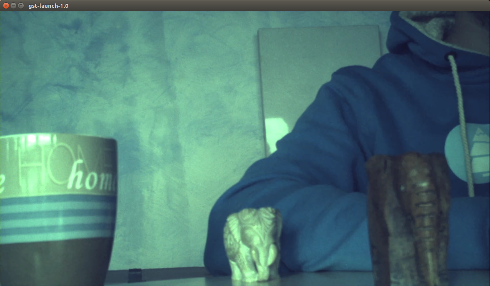</br>Screenshot</p>
    Not bad, but it has still a slight green color cast, so the values here would have to be adjusted using the gamma correction.

#### Yavta- recording frames
* For completeness it must be mentioned that frames can also be recorded using yavta. See the `yavta -h` or the Manpage for more information.
    ```shell
    ~$ yavta -c1 -F -fUYVY -s1920x1080 /dev/video0
    ```
    <details><summary>show more</summary>

    ```shell
    Device /dev/video0 opened.
    Device `video_cap output 0' on `platform:video_cap:0' is a video output (without mplanes) device.
    Video format set: UYVY (59565955) 1920x1080 field none, 1 planes: 
     * Stride 3840, buffer size 4147200
    Video format: UYVY (59565955) 1920x1080 field none, 1 planes: 
     * Stride 3840, buffer size 4147200
    8 buffers requested.
    length: 1 offset: 4022187616 timestamp type/source: mono/EoF
    Buffer 0/0 mapped at address 0x7faf2ce000.
    length: 1 offset: 4022187616 timestamp type/source: mono/EoF
    Buffer 1/0 mapped at address 0x7faeed9000.
    length: 1 offset: 4022187616 timestamp type/source: mono/EoF
    Buffer 2/0 mapped at address 0x7faeae4000.
    length: 1 offset: 4022187616 timestamp type/source: mono/EoF
    Buffer 3/0 mapped at address 0x7fae6ef000.
    length: 1 offset: 4022187616 timestamp type/source: mono/EoF
    Buffer 4/0 mapped at address 0x7fae2fa000.
    length: 1 offset: 4022187616 timestamp type/source: mono/EoF
    Buffer 5/0 mapped at address 0x7fadf05000.
    length: 1 offset: 4022187616 timestamp type/source: mono/EoF
    Buffer 6/0 mapped at address 0x7fadb10000.
    length: 1 offset: 4022187616 timestamp type/source: mono/EoF
    Buffer 7/0 mapped at address 0x7fad71b000.
    0 (0) [-] none 0 0 B 3143.870703 3143.870715 11.604 fps ts mono/EoF
    Captured 1 frames in 0.086188 seconds (11.602538 fps, 0.000000 B/s).
    8 buffers released.
    ```
    </details>

    Convert the raw file with help of `ffmpeg`.
    ```shell
    ~$ mv frame-000000.bin frame-000000.rgb
    ~$ ffmpeg -s 1920x1080 -pix_fmt uyvy422 -i frame-000000.rgb -pix_fmt rgb24 frame0.png
    ```

[[Back to top]](#example-4---mobile-industry-processor-interface)


## FAQ
1. **Q:** What do the Gstreamer parameters mean?
    <details><summary>show more</summary>

    **A:** `gst-inspect-1.0` is a tool that prints out information on available GStreamer plugins, information about a particular plugin, or information about a particular element.
    </details>

[[Back to top]](#example-4---mobile-industry-processor-interface)

[allegrodvt.com]: https://www.allegrodvt.com
[omx_il]: https://github.com/Xilinx/vcu-omx-il
[vcu-firmware]: https://github.com/xilinx/vcu-firmware
[vcu-modules]: https://github.com/xilinx/vcu-modules

[Mercury+ ST1]: https://www.enclustra.com/en/products/base-boards/mercury-st1
[Mercury+ XU8]: https://www.enclustra.com/en/products/system-on-chip-modules/mercury-xu8
[XU8+ST1+RefDes]: https://github.com/enclustra/Mercury_XU8_ST1_Reference_Design
[XU8+ST1+RefDes+Doc]: https://github.com/enclustra/Mercury_XU8_ST1_Reference_Design/blob/master/reference_design/doc/Mercury_XU8_ST1.pdf
[XU8 Schematics]: https://download.enclustra.com/public_files/SoC_Modules/Mercury+_XU8/Mercury_XU8-R2-1_User_Schematics_V3.pdf
[ST1+Schematics]: https://download.enclustra.com/public_files/Base_Boards/Mercury+_ST1/ME-ST1_User_Schematics_V4.pdf

[xilinx-csi2rxss.c]: https://github.com/Xilinx/linux-xlnx/blob/master/drivers/media/platform/xilinx/xilinx-csi2rxss.c#L1766
[xilinx-vip.c]: https://github.com/Xilinx/linux-xlnx/blob/master/drivers/media/platform/xilinx/xilinx-vip.c

[DTS+CSC]: https://github.com/Xilinx/linux-xlnx/blob/xilinx-v2020.1/Documentation/devicetree/bindings/media/xilinx/xlnx%2Cv-vpss-csc.txt
[DTS+CSI2]: https://github.com/Xilinx/linux-xlnx/blob/xilinx-v2020.1/Documentation/devicetree/bindings/media/xilinx/xlnx%2Ccsi2rxss.txt
[DTS+Demosaic]: https://github.com/Xilinx/linux-xlnx/blob/xilinx-v2020.1/Documentation/devicetree/bindings/media/xilinx/xlnx,v-demosaic.txt
[DTS+LUT]: https://github.com/Xilinx/linux-xlnx/blob/xilinx-v2020.1/Documentation/devicetree/bindings/media/xilinx/xlnx,v-gamma-lut.txt
[DTS+Video]: https://github.com/Xilinx/linux-xlnx/blob/xilinx-v2020.1/Documentation/devicetree/bindings/media/xilinx/xlnx%2Cvideo.txt

[MIPI CSI2 RX]: https://www.xilinx.com/support/documentation/ip_documentation/mipi_csi2_rx_subsystem/v5_0/pg232-mipi-csi2-rx.pdf
[Sensor Demosaic (1.0)]: https://www.xilinx.com/support/documentation/ip_documentation/v_demosaic/v1_0/pg286-v-demosaic.pdf
[Gamma LUT (1.0)]: https://www.xilinx.com/support/documentation/ip_documentation/v_gamma_lut/v1_0/pg285-v-gamma-lut.pdf
[Video Processing Sybsystem (2.2)]: https://www.xilinx.com/support/documentation/ip_documentation/v_proc_ss/v2_1/pg231-v-proc-ss.pdf
[Video Frame Buffer Write]: https://www.xilinx.com/support/documentation/ip_documentation/v_frmbuf/v2_1/pg278-v-frmbuf.pdf
[xapp894-d-phy-solutions]: https://www.xilinx.com/support/documentation/application_notes/xapp894-d-phy-solutions.pdf

[Xilinx V4L2 driver]: https://xilinx-wiki.atlassian.net/wiki/spaces/A/pages/18841767/Xilinx+V4L2+driver

[GStreamer]: https://gstreamer.freedesktop.org
[gst-inspect]: https://gstreamer.freedesktop.org/documentation/tools/gst-inspect.html
[IMX219 Datasheet]: https://raw.githubusercontent.com/circuitvalley/mipi_csi_receiver_FPGA/master/Camera%20Datasheet/RASPBERRY%20PI%20CAMERA%20V2%20DATASHEET%20IMX219PQH5_7.0.0_Datasheet_XXX.PDF
[IMX219 Driver]: https://github.com/raspberrypi/linux/commits/rpi-5.4.y/drivers/media/i2c/imx219.c
[IMX219 Pinout]: https://www.arducam.com/raspberry-pi-camera-pinout/
[MIPI CSI Specification]: https://mipi.org/specifications/camera-and-imaging#CSI2
[V4L]: https://www.linuxtv.org/wiki/index.php
[V4L-utils]: https://www.linuxtv.org/wiki/index.php/V4l-utils
[V4L-Api]: https://www.kernel.org/doc/html/v5.10/driver-api/media/v4l2-core.html
[V4L-Api-mediactl]:https://www.kernel.org/doc/html/v5.10/driver-api/media/v4l2-mc.html
[V4L-Api-subdev]: https://www.kernel.org/doc/html/v5.10/driver-api/media/v4l2-subdev.html?highlight=v4l2%20subdev

<br />
<div>
    <p><a href="https://www.enclustra.com"></a></p>
    <p style="color:white;">
</div>

Please visit https://www.enclustra.com for more information about our **products**, **design services** or **technical questions** and **solutions**.  
