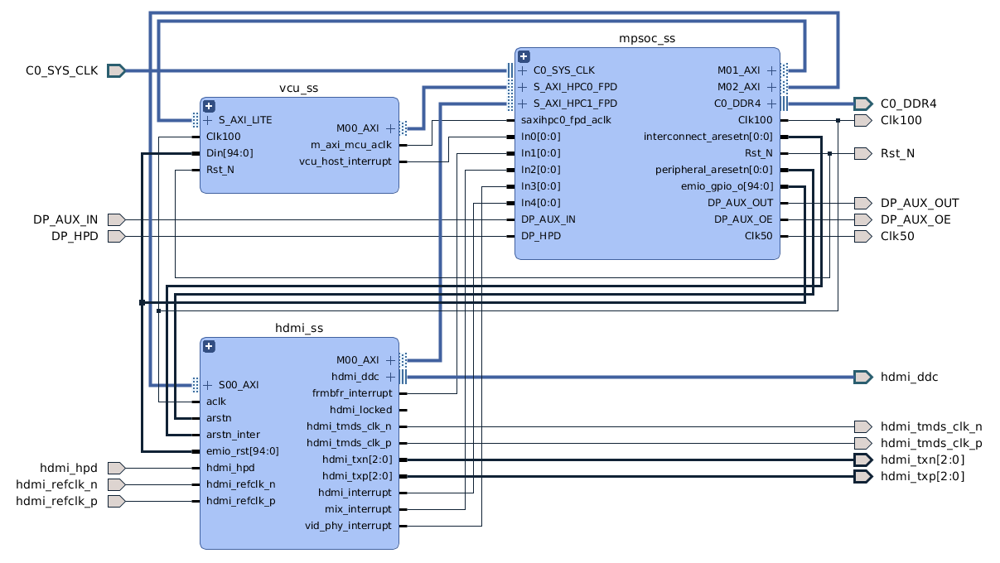
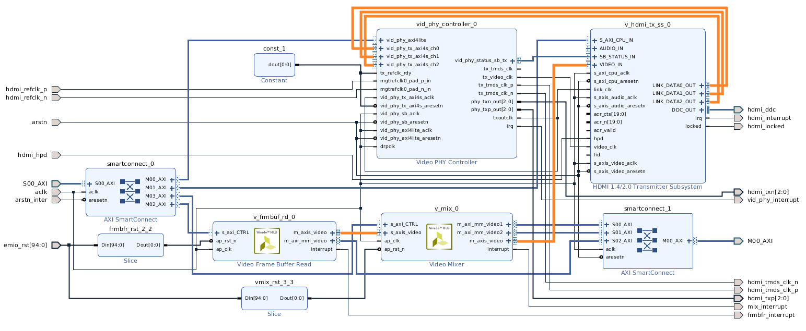
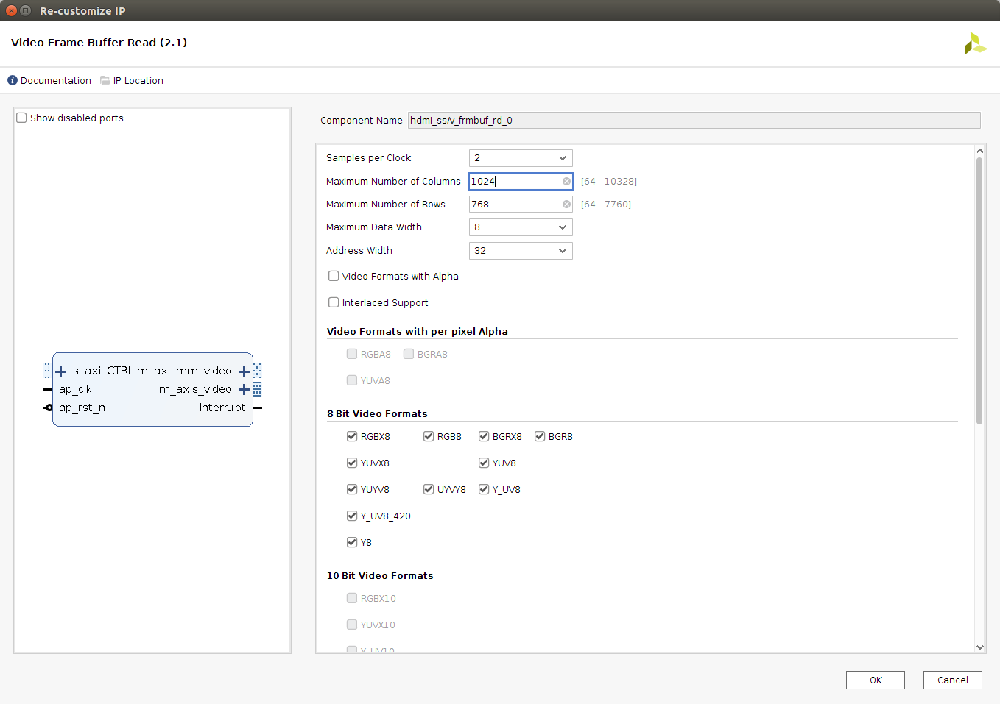
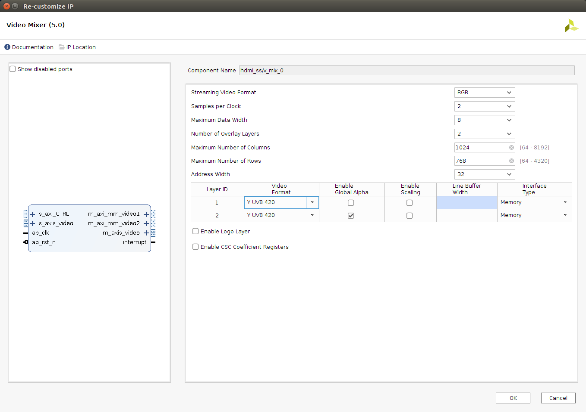
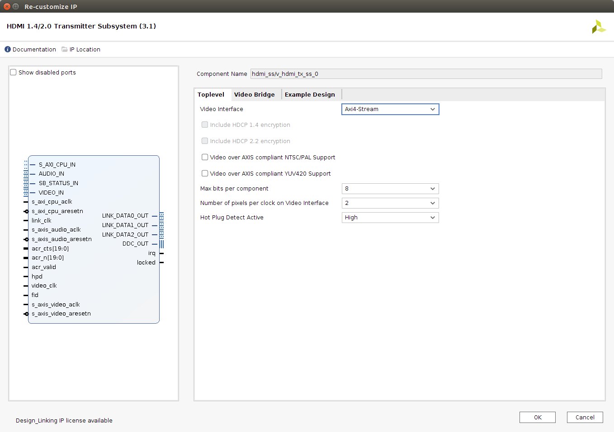
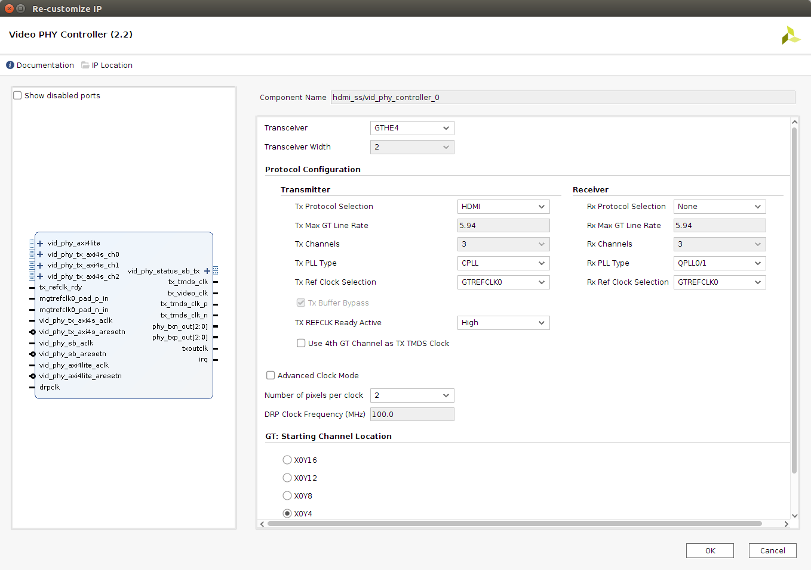
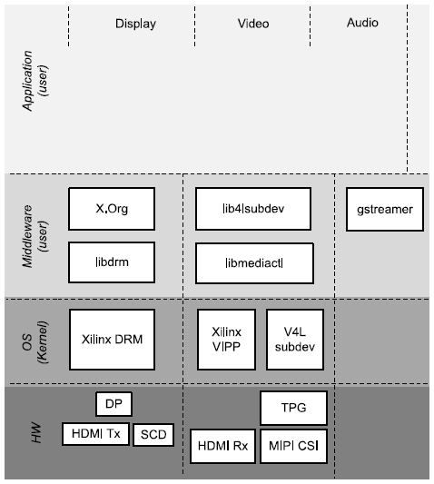
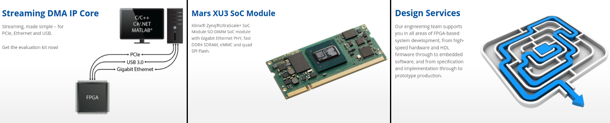

<div>
    <p><a href="https://www.enclustra.com"></a></p>
    <p style="color:white;">&nbsp;</p>
</div>


# Example 5 - HDMI - Tx

1. [Introduction](#introduction)
2. [Firmware Design](#firmware-design)
3. [Software Design](#software-design)
4. [Run Flow](#run-flow)
5. [FAQ](#faq)


## Introductions
The primary goal of this example is to demonstrate the basic capabilities of the HDMI cores which can be implemented as soft IPs inside Zynq UltraScale+ MPSoC EV/EG devices (see [PG235] for supported features). The design uses Vivado IP Integrator (IPI) flow for building the firmware design and Xilinx Yocto PetaLinux flow for the software design.

The steps in this Application Note can be adapted to a wide range of Enclustra modules (EG and EV variants), baseboards (ST1 and ST3). For demonstration purposes and as a guide, the Enclustra [Mercury+ XU8] module and [Mercury+ ST1] baseboard are used to illustrate the necessary steps. It is based on the corresponding [Vivado reference design][XU8+ST1+RefDes] as well as PetaLinux BSP.

Now, what do we need to start? Additionally to the [common prerequisites](../CommonInformation.md#prerequisites), the following items are required:
* HDMI Monitor
* HDMI Cable

[[Back to top]](#example-5---high-definition-multimedia-interface-tx)


## Firmware Design
Below is the reference design with slight modifications, but essentially everything that needs to be packaged into its corresponding hierarchy. To verify the pinning of the necessary ports `hdmi_*` have a look at the schematics [ST1+Schematics] and [XU8+Schematics].

> ℹ **_NOTE:_** Instructions on how to create and build the design can be found [here](../CommonInformation.md#firmware-build).

> ℹ **_NOTE:_** To build the firmware, you must request a temporary [evaluation license](https://www.xilinx.com/member/forms/license-form.html?tab=CreateLicense&product=0452460) for the hdmi transmitter subsystem.

> ℹ **_NOTE:_** Xilinx provides the HDCP IP License (including evaluation license) for HDCP adopters only. See the [DPC Licensee list](https://www.digital-cp.com/licensee-list) for details.


<p align="center"></br>Blockdesign overview</p>

But now to the interesting part for us, let's have a closer look at the hdmi_ss hierarchy. We will focus on the basic components.
<p align="center"></br>Blockdesign HDMI hierarchy</p>

The [Video Frame Buffer Read v2.1][PG278] should be known simple to configuration for the image resolution 1024x768 and all possible 8 bit video formats.
<p align="center"></br>Settings Video Frame Buffer Read</p>

The [Video Mixer v5.0][PG243] core provides a flexible video processing block for alpha blending and compositing multiple video and/or graphics layers. We use four layers this includes the primary layer and two additional layers plus an extra layer just for the logo. The primary layer is fed in via the frame buffer read and the other layers are taken memory mapped directly by the mixer.
<p align="center"></br>Settings Video Mixer</p>

The [HDMI 1.4/2.0 Transmitter Subsystem v3.1][PG235] is a hierarchical IP that bundles a collection of HDMI IP sub-cores and outputs them as a single IP. It is an out-of-the-box HDMI 1.4/2.0 Transmitter Subsystem and avoids the need to manually assemble sub-cores to create a working system. The configuration as in the illustration, receiving video interface axis, pixel- and bit-rate as above and the hot-plug event is active high.
<p align="center"></br>Settings HDMI 1.4/2.0 Transmitter Subsystem</p>

The [Video PHY Controller v2.2][PG230] is a feature-rich soft IP core that contains all the necessary logic to properly interface to the Media Access Control (MAC) layers and perform Physical-Side Interface (PHY) functionality. The receiver has to be disabled, the protocol HDMI the PLL type CPLL, the ref clock GTREFCLK0 (see [XU8+Schematics] and [ST1+Schematics]) and the tx refclk ready singal is active high.
<p align="center"></br>Video PHY Controller</p>

[[Back to top]](#example-5---high-definition-multimedia-interface-tx)


## Software Design
> ℹ **_NOTE:_** Instructions on how to create and build the design can be found [here](../CommonInformation.md#firmware-build).

<p align="center"></br>Software Layers</p>

The focus is here on the Linux DRM driver for Xilinx HDMI Tx Soft IP [KMS+HDMI+Tx], more information about libdrm and the Xilinx DRM KMS drivers can be found in [Example1-DP](../example1-dp/Readme.md#software-design).

The driver is implemented as a sub-component of the Xilinx DRM KMS bridge driver and implements the encoder/connector interface. The subsystem includes the video timing generator and Tx sub-core. Driver implements the DRM callbacks to read the display EDID and present it to the framework anytime a display is connected. It works in tandem with the DRM bridge driver to validates each mode listed in the EDID and reject unsupported modes.

> ℹ **_NOTE:_** This driver doesn't support Xilinx DRM bridge. So display pipelines like `Framebuffer Read → VPSS Scaler → HDMI Tx` will not work.

### PetaLinux
What needs to be configured, where it can be found in the BSP, will now be examined in more detail.

> ℹ **_NOTE:_** Instructions to create the BSP can be found **[here](../CommonInformation.md#petalinux-build)**.

All necessary changes are already contained in the build with the pre-made BSP [`patch/ME-XU8-7EV-2I-D12E_ST1_SD.patch`](patch/ME-XU8-7EV-2I-D12E_ST1_SD.patch), but I invite you to review the changes and adapt them to your needs.

#### Root file system customization
To make it easier to find all the packages needed for the rootfs, simply examine the configuration file `<PetaLinux project root dir>/project-spec/configs/rootfs_config`.
* Packages for hdmi (hdmi_tx and vphy driver). Since it is added as an out-of-tree kernel module, there is not kernel configuration required. Instead user must include the driver in the rootfs.
    ```
    CONFIG_kernel-module-hdmi=y
    ```
* Packages for libdrm which includes modetest
    ```
    CONFIG_libdrm=y
    CONFIG_libdrm-tests=y
    CONFIG_libdrm-drivers=y
    CONFIG_libdrm-kms=y
    ```
* Packages for [GStreamer]
    ```
    CONFIG_packagegroup-petalinux-gstreamer=y
    ```

#### Kernel changes
The Kernel brings built in support for the DRM framework from Xilinx. Further, the HDMI driver works with the new framework.

* DRM framework requests the registered clock producer (SI5338 for HDMI) to generate the correct clock for desired mode. The SI5338 is a low-bandwidth, jitter-attenuating, precision clock multiplier for applications requiring low jitter ([Data-sheet](https://www.silabs.com/documents/public/data-sheets/Si5338.pdf), [Reference-Manual](https://www.silabs.com/documents/public/reference-manuals/Si5338-RM.pdf)). Such an external clock is essential to be able to configure the clocks in a variable way, furthermore the "Video PHY Controller v2.2" IP-CORE expects a clock via the clock ports. The complete patch file `si5338.patch` can be found in the BSP, to activate it the following config flag needs to be added to the kernel configuration.
    ```
    CONFIG_COMMON_CLK_SI5338=y
    ```
* A big problem is caused by a simple printout in `drm_atomic_helper.c`. To prevent the driver from crashing regularly, the patch `0004-drm_atomic_helper-Supress-vblank-timeout-warning-mes.patch` gets included which comments out the respective lines (included in the [BSP patch](patch/ME-XU8-7EV-2I-D12E_ST1_SD.patch)).

* Enabling the primary of the video mixer is causing by default a bandwidth usage of 2GB/s at startup. The patch `0003-drm-xlnx_mixer-Dont-enable-primary-plane-by-default.patch` is used to disable the mixer primary plane by default (included in the [BSP patch](patch/ME-XU8-7EV-2I-D12E_ST1_SD.patch)).

#### Device tree changes
The following modifications were made to the device tree (see `<PetaLinux project root>/project-spec/meta-user/recipes-bsp/device-tree/files/pl-custom.dtsi`).

> ⚠ **_WARNING:_** Most nodes for the PL that are automatically generated by PetaLinux are partly incorrect and must be modified. E.g. compatible strings, missing resets and wrong clocks (see the device tree overlays snippets below).

* Device tree nodes for the fixed PL clocks `ref100PL` and `ref65`.
    <details><summary>show more</summary>

    ```dts
      &amba_pl {
        ref65: ref65M {
          compatible = "fixed-clock";
          #clock-cells = <0>;
          clock-frequency = <65000000>;
        };

        ref100PL: ref100MPL {
          compatible = "fixed-clock";
          #clock-cells = <0>;
          clock-frequency = <100000000>;
        };
      };
    ```
    </details>
* `hdmi_ss_v_frmbuf_rd_0` - Add the missing reset gpio.
    ```dts
    &hdmi_ss_v_frmbuf_rd_0 {
      reset-gpios = <&gpio 80 1>;
    };
    ```
* `hdmi_ss_v_mix_0` - Out of scope of this topic. But everything needed can be found in the [kernel sources](https://github.com/Xilinx/linux-xlnx/blob/xilinx-v2020.1/Documentation/devicetree/bindings/display/xlnx/xlnx,mixer.txt).
    <details><summary>show more</summary>

    <pre>
    &hdmi_ss_v_mix_0 {
      <b>reset-gpios = <&gpio 81 1>;</b>

      layer_0 {
        xlnx,layer-id = <0>;
        xlnx,vformat = "YUYV";
        xlnx,layer-max-width = <1024>;
        xlnx,layer-max-height = <768>;
        dmas = <&hdmi_ss_v_frmbuf_rd_0 0>;
        dma-names = "dma0";
        xlnx,layer-streaming;
        xlnx,layer-primary;
      };

      layer_1 {
        xlnx,layer-id = <1>;
        xlnx,vformat = "NV12";
      };

      layer_2 {
        xlnx,layer-id = <2>;
        xlnx,vformat = "NV12";
        xlnx,layer-alpha;
      };

      logo {
        xlnx,layer-id = <3>;
        xlnx,logo-height = <64>;
        xlnx,logo-width = <64>;
      };

      port@0 {
        reg = <0>;
        hdmi_panel: endpoint {
          remote-endpoint = <&hdmi_encoder>;
        };
      };
    };
    </pre>
    </details>
* `hdmi_ss_vid_phy_controller_0` - Provide the correct clock.
    <pre>
    &hdmi_ss_vid_phy_controller_0 {
      <b>clock-names = "vid_phy_axi4lite_aclk";</b>
      <b>clocks = <&ref100PL>;</b>
    };
    </pre>
* `hdmi_ss_v_hdmi_tx_ss_0` - Specify the correct clocks, note that the 65 MHz clock is fixed. Add the the correct values for the pixel per clocks, bits per component and the missing video phy lanes. Last but not least, a port with a video endpoint, or more precisely a sink, is added.
    ```dts
    &hdmi_ss_v_hdmi_tx_ss_0 {
      <b>clock-names = "s_axi_cpu_aclk", "s_axis_video_aclk", "txref-clk", "retimer-clk";</b>
      <b>clocks = <&ref100PL>, <&ref100PL>, <&ref65>, <&ref65>;</b>
      phy-names = "hdmi-phy0", "hdmi-phy1", "hdmi-phy2";
      phys = <&vphy_lane0 0 1 1 1>, <&vphy_lane1 0 1 1 1>, <&vphy_lane2 0 1 1 1>;
      xlnx,input-pixels-per-clock = <0x2>;
      xlnx,max-bits-per-component = <0x8>;

      ports {
        #address-cells = <1>;
        #size-cells = <0>;
        encoder_hdmi_port: port@0 {
          reg = <0>;
          hdmi_encoder: endpoint {
            remote-endpoint = <&hdmi_panel>;
          };
        };
      };
    };
    ```

[[Back to top]](#example-5---high-definition-multimedia-interface-tx)


## Run Flow
1. Setup the hardware accordingly to the [Mercury+ ST1 User Manual][XU8+ST1+RefDes+Doc]. The jumpers for the correct I/O voltage and the configuration dip switch for sd card boot mode.

2. Now enable the primary plane of the video mixer. The plane was disabled to limit the bandwidth used.
    ```shell
    ~$ echo Y > /sys/module/xlnx_mixer/parameters/mixer_primary_enable
    ```
    
3. Set the correct resolution and test layer 0 which corresponds to plane 35 (see [Video+Mixer]).
    ```shell
    ~$ modetest -D 80030000.v_mix -s 38@36:1024x768-60@BG24
    trying to open device 'i915'...done
    setting mode 1024x768-60.00Hz@BG24 on connectors 38, crtc 36
    ```
    The primary plane which get fed via axis should be presented with common test pattern on screen. Press "Enter" to exit.

    * Test layer 1 which corresponds to plane 33.
      ```shell
      ~$ modetest -D 80030000.v_mix -P 33@36:640x480+200+100@NV12
      ```
    * Test layer 2 which corresponds to plane 34.
      ```shell
      ~$ modetest -D 80030000.v_mix -P 34@36:320x240+0+0@NV12
      ```

4. Check supported video formats. Below you can see the to be expected result. Note that we only can configure "1024x768 @ 60Hz 4:3", because we configured the SI5338 for exactly 65MHz. The pixel clock can be calculated by multiplying the total vertical pixel (htot), the total horizontal pixel (vtot) and the refresh rate ( in our case `1344*806*60 = 649958405`). See the output of the command below, the required values can be found under `Connectors → modes`.
    ```shell
    ~$ modetest -D 80030000.v_mix
    ```
    <details><summary>show more</summary>

    ```shell
      trying to open device 'i915'...done
      Encoders:
      id      crtc    type    possible crtcs  possible clones
      37      36      TMDS    0x00000001      0x00000000

      Connectors:
      id      encoder status          name            size (mm)       modes   encoders
      38      37      connected       HDMI-A-1        160x90          29      37
        modes:
              name refresh (Hz) hdisp hss hse htot vdisp vss vse vtot)
        1920x1080 60.00 1920 2008 2052 2200 1080 1084 1089 1125 148500 flags: phsync, pvsync; type: preferred, driver
        1920x1080 60.00 1920 2008 2052 2200 1080 1084 1089 1125 148500 flags: phsync, pvsync; type: driver
        1920x1080 59.94 1920 2008 2052 2200 1080 1084 1089 1125 148352 flags: phsync, pvsync; type: driver
        1920x1080 50.00 1920 2448 2492 2640 1080 1084 1089 1125 148500 flags: phsync, pvsync; type: driver
        1600x1200 60.00 1600 1664 1856 2160 1200 1201 1204 1250 162000 flags: phsync, pvsync; type: driver
        1680x1050 59.88 1680 1728 1760 1840 1050 1053 1059 1080 119000 flags: phsync, nvsync; type: driver
        1280x1024 60.02 1280 1328 1440 1688 1024 1025 1028 1066 108000 flags: phsync, pvsync; type: driver
        1440x900 59.90 1440 1488 1520 1600 900 903 909 926 88750 flags: phsync, nvsync; type: driver
        1280x960 60.00 1280 1376 1488 1800 960 961 964 1000 108000 flags: phsync, pvsync; type: driver
        1920x1080i 30.00 1920 2008 2052 2200 540 1084 1094 1125 74250 flags: phsync, pvsync, interlace; type: driver
        1920x1080i 30.00 1920 2008 2052 2200 540 1084 1094 1125 74250 flags: phsync, pvsync, interlace; type: driver
        1920x1080i 29.97 1920 2008 2052 2200 540 1084 1094 1125 74176 flags: phsync, pvsync, interlace; type: driver
        1920x1080i 25.00 1920 2448 2492 2640 540 1084 1094 1125 74250 flags: phsync, pvsync, interlace; type: driver
        1920x1080i 25.00 1920 2448 2492 2640 540 1084 1094 1125 74250 flags: phsync, pvsync, interlace; type: driver
        1280x800 59.91 1280 1328 1360 1440 800 803 809 823 71000 flags: phsync, nvsync; type: driver
        1280x720 60.00 1280 1390 1430 1650 720 725 730 750 74250 flags: phsync, pvsync; type: driver
        1280x720 60.00 1280 1390 1430 1650 720 725 730 750 74250 flags: phsync, pvsync; type: driver
        1280x720 59.94 1280 1390 1430 1650 720 725 730 750 74176 flags: phsync, pvsync; type: driver
        1280x720 50.00 1280 1720 1760 1980 720 725 730 750 74250 flags: phsync, pvsync; type: driver
        1280x720 50.00 1280 1720 1760 1980 720 725 730 750 74250 flags: phsync, pvsync; type: driver
        1024x768 60.00 1024 1048 1184 1344 768 771 777 806 65000 flags: nhsync, nvsync; type: driver
        800x600 60.32 800 840 968 1056 600 601 605 628 40000 flags: phsync, pvsync; type: driver
        800x600 56.25 800 824 896 1024 600 601 603 625 36000 flags: phsync, pvsync; type: driver
        720x576 50.00 720 732 796 864 576 581 586 625 27000 flags: nhsync, nvsync; type: driver
        720x576 50.00 720 732 796 864 576 581 586 625 27000 flags: nhsync, nvsync; type: driver
        720x480 60.00 720 736 798 858 480 489 495 525 27027 flags: nhsync, nvsync; type: driver
        720x480 59.94 720 736 798 858 480 489 495 525 27000 flags: nhsync, nvsync; type: driver
        640x480 60.00 640 656 752 800 480 490 492 525 25200 flags: nhsync, nvsync; type: driver
        640x480 59.94 640 656 752 800 480 490 492 525 25175 flags: nhsync, nvsync; type: driver
        props:
              1 EDID:
                      flags: immutable blob
                      blobs:

                      value:
                              00ffffffffffff004c2d570633324857
                              08140103801009782aee91a3544c9926
                              0f5054230800a9408180814081009500
                              b30001010101023a801871382d40582c
                              4500a05a0000001e011d007251d01e20
                              6e285500a05a0000001e000000fd0032
                              3c1b5111000a202020202020000000fc
                              0053796e634d61737465720a2020013b
                              02031cf34890041f0514130312230907
                              078301000066030c00100080011d80d0
                              721c1620102c2580a05a0000009e011d
                              8018711c1620582c2500a05a0000009e
                              011d00bc52d01e20b8285540a05a0000
                              001e011d007251d01e206e285500a05a
                              0000001e8c0ad090204031200c405500
                              a05a0000001800000000000000000075
              2 DPMS:
                      flags: enum
                      enums: On=0 Standby=1 Suspend=2 Off=3
                      value: 0
              5 link-status:
                      flags: enum
                      enums: Good=0 Bad=1
                      value: 0
              6 non-desktop:
                      flags: immutable range
                      values: 0 1
                      value: 0
              4 TILE:
                      flags: immutable blob
                      blobs:

                      value:
              20 CRTC_ID:
                      flags: object
                      value: 36

      CRTCs:
      id      fb      pos     size
      36      42      (0,0)   (1024x768)
        1024x768 60.00 1024 1048 1184 1344 768 771 777 806 65000 flags: nhsync, nvsync; type: driver
        props:
              22 ACTIVE:
                      flags: range
                      values: 0 1
                      value: 1
              23 MODE_ID:
                      flags: blob
                      blobs:

                      value:
                              e8fd000000041804a004400500000003
                              03030903260300003c0000000a000000
                              40000000313032347837363800000000
                              00000000000000000000000000000000
                              00000000
              19 OUT_FENCE_PTR:
                      flags: range
                      values: 0 18446744073709551615
                      value: 0
              24 VRR_ENABLED:
                      flags: range
                      values: 0 1
                      value: 0

      Planes:
      id      crtc    fb      CRTC x,y        x,y     gamma size      possible crtcs
      33      0       0       0,0             0,0     0               0x00000001
        formats: NV12
        props:
              8 type:
                      flags: immutable enum
                      enums: Overlay=0 Primary=1 Cursor=2
                      value: 0
              17 FB_ID:
                      flags: object
                      value: 0
              18 IN_FENCE_FD:
                      flags: signed range
                      values: -1 2147483647
                      value: -1
              20 CRTC_ID:
                      flags: object
                      value: 0
              13 CRTC_X:
                      flags: signed range
                      values: -2147483648 2147483647
                      value: 0
              14 CRTC_Y:
                      flags: signed range
                      values: -2147483648 2147483647
                      value: 0
              15 CRTC_W:
                      flags: range
                      values: 0 2147483647
                      value: 0
              16 CRTC_H:
                      flags: range
                      values: 0 2147483647
                      value: 0
              9 SRC_X:
                      flags: range
                      values: 0 4294967295
                      value: 0
              10 SRC_Y:
                      flags: range
                      values: 0 4294967295
                      value: 0
              11 SRC_W:
                      flags: range
                      values: 0 4294967295
                      value: 0
              12 SRC_H:
                      flags: range
                      values: 0 4294967295
                      value: 0
      34      36      42      0,0             0,0     0               0x00000001
        formats: NV12
        props:
              8 type:
                      flags: immutable enum
                      enums: Overlay=0 Primary=1 Cursor=2
                      value: 1
              17 FB_ID:
                      flags: object
                      value: 42
              18 IN_FENCE_FD:
                      flags: signed range
                      values: -1 2147483647
                      value: -1
              20 CRTC_ID:
                      flags: object
                      value: 36
              13 CRTC_X:
                      flags: signed range
                      values: -2147483648 2147483647
                      value: 0
              14 CRTC_Y:
                      flags: signed range
                      values: -2147483648 2147483647
                      value: 0
              15 CRTC_W:
                      flags: range
                      values: 0 2147483647
                      value: 1024
              16 CRTC_H:
                      flags: range
                      values: 0 2147483647
                      value: 768
              9 SRC_X:
                      flags: range
                      values: 0 4294967295
                      value: 0
              10 SRC_Y:
                      flags: range
                      values: 0 4294967295
                      value: 0
              11 SRC_W:
                      flags: range
                      values: 0 4294967295
                      value: 67108864
              12 SRC_H:
                      flags: range
                      values: 0 4294967295
                      value: 50331648
      35      0       0       0,0             0,0     0               0x00000001
        formats: BG24
        props:
              8 type:
                      flags: immutable enum
                      enums: Overlay=0 Primary=1 Cursor=2
                      value: 0
              17 FB_ID:
                      flags: object
                      value: 0
              18 IN_FENCE_FD:
                      flags: signed range
                      values: -1 2147483647
                      value: -1
              20 CRTC_ID:
                      flags: object
                      value: 0
              13 CRTC_X:
                      flags: signed range
                      values: -2147483648 2147483647
                      value: 0
              14 CRTC_Y:
                      flags: signed range
                      values: -2147483648 2147483647
                      value: 0
              15 CRTC_W:
                      flags: range
                      values: 0 2147483647
                      value: 0
              16 CRTC_H:
                      flags: range
                      values: 0 2147483647
                      value: 0
              9 SRC_X:
                      flags: range
                      values: 0 4294967295
                      value: 0
              10 SRC_Y:
                      flags: range
                      values: 0 4294967295
                      value: 0
              11 SRC_W:
                      flags: range
                      values: 0 4294967295
                      value: 0
              12 SRC_H:
                      flags: range
                      values: 0 4294967295
                      value: 0

      Frame buffers:
      id      size    pitch
      ```
    </details>

5. Get status information of the hdmi/phy stream/driver (see "Device Control" in [KMS+HDMI+Tx]).
* Shows detected stream properties
    ```shell
    ~$ cat /sys/devices/platform/amba_pl\@0/80000000.v_hdmi_tx_ss/hdmi_info
    ```
    <details><summary>show more</summary>

    ```shell
      Stream Info
      -------------
            Color Format:     RGB60Hz
            Color Depth:      8
            Pixels Per Clock: 2
            Mode:             Progressive
            Frame Rate:       60Hz
            Resolution:       1024x768@60Hz
            Pixel Clock:      64995840

      Stream Timing
      ----------------

            HSYNC Timing: hav=1024, hfp=24, hsw=136(hsp=0), hbp=160, htot=1344
            VSYNC Timing: vav=0768, vfp=03, vsw=06(vsp=0), vbp=029, vtot=0806

      Tx Info
      --------
      TX Mode - HDMI
      HDMI Video Mask is Disabled

      Scrambled: 0
      Sample rate: 0
      Audio channels: 0
    ```
    </details>

* Shows event logs captured by the driver
    ```shell
    ~$ cat /sys/devices/platform/amba_pl\@0/80000000.v_hdmi_tx_ss/hdmi_log
    ```
     <details><summary>show more</summary>

     ```shell
      HDMI TX log
      ------
      Initializing HDMI TX core....
      Initializing VTC core....
      Reset HDMI TX Subsystem....
      TX cable is connected....
      TX Stream Start
      TX Audio Unmuted
      TX Set Stream, with video mode (120)
      TX cable is disconnected....
      TX cable is connected....
      TX Stream Start
      TX Audio Unmuted
      TX Set Stream, with video mode (42)
      TX Set Stream, with video mode (120)
      TX Audio Unmuted
      TX Set Stream, with video mode (42)
      TX Audio Unmuted
      TX Audio Unmuted
      TX Audio Unmuted
    ```
     </details>

* Shows video_phy status for both Rx and Tx
    ```shell
    ~$ cat /sys/devices/platform/amba_pl\@0/80000000.v_hdmi_tx_ss/vphy_info
    ```
    <details><summary>show more</summary>

    ```shell
      TX: CPLL
      TX state: idle

      CPLL settings
      -------------
      M : 1 - N1 : 5 - N2 : 8 - D : 8

      TX MMCM settings
      -------------
      Mult : 24 - Div : 1 - Clk0Div : 48 - Clk1Div : 24 - Clk2Div : 48

      Tx Ref Clk: 65003520 Hz
    ```
    </details>

* Shows event logs captured by both Rx and Tx
     ```shell
     ~$ cat /sys/devices/platform/amba_pl\@0/80000000.v_hdmi_tx_ss/vphy_log
     ```
     <details><summary>show more</summary>

    ```shell
      VPHY log
      ------
      GT init start
      GT init done
      TX frequency event
      TX timer event
      CPLL reconfig done
      GT TX reconfig start
      GT TX reconfig done
      TX frequency event
      TX frequency event
      TX timer event
      TX MMCM reconfig done
      CPLL reconfig done
      GT TX reconfig start
      GT TX reconfig done
      TX MMCM lock
    ```
     </details>

#### Test procedure

* To show something worthwhile and not just a static image on the display we use [Gstreamer]. As a first step the default test pattern with image noise. To modify the test pattern have a look at [GST+videotestsrc][GST+videotestsrc].
    ```shell
    ~$ gst-launch-1.0 -v videotestsrc pattern=smpte100 ! video/x-raw,width=1024,height=768 ! \
    fpsdisplaysink video-sink="kmssink plane-id=35 bus-id="80030000.v_mix" sync=false"
    ```
    <details><summary>show more</summary>

   ```shell
    Setting pipeline to PAUSED ... gst-launch-1.0 -v videotestsrc ! video/x-raw,width=1024,height=768 ! fpsdisplaysink video-sink="kmssink plane-id=36 bus-id="80030000.v_mix" sync=false
    Pipeline is PREROLLING ...
    /GstPipeline:pipeline0/GstFPSDisplaySink:fpsdisplaysink0/GstKMSSink:kmssink0: display-width = 1024
    /GstPipeline:pipeline0/GstFPSDisplaySink:fpsdisplaysink0/GstKMSSink:kmssink0: display-height = 768
    /GstPipeline:pipeline0/GstFPSDisplaySink:fpsdisplaysink0/GstKMSSink:kmssink0: sync = true
    /GstPipeline:pipeline0/GstVideoTestSrc:videotestsrc0.GstPad:src: caps = video/x-raw, format=(string)YUY2, width=(int)1024, height=(int)768, framerate=(fraction)30/1, multiview-mode=e
    /GstPipeline:pipeline0/GstCapsFilter:capsfilter0.GstPad:src: caps = video/x-raw, format=(string)YUY2, width=(int)1024, height=(int)768, framerate=(fraction)30/1, multiview-mode=(stre
    /GstPipeline:pipeline0/GstFPSDisplaySink:fpsdisplaysink0.GstGhostPad:sink.GstProxyPad:proxypad0: caps = video/x-raw, format=(string)YUY2, width=(int)1024, height=(int)768, frameratee
    /GstPipeline:pipeline0/GstFPSDisplaySink:fpsdisplaysink0/GstTextOverlay:fps-display-text-overlay.GstPad:src: caps = video/x-raw, format=(string)YUY2, width=(int)1024, height=(int)76e
    /GstPipeline:pipeline0/GstFPSDisplaySink:fpsdisplaysink0/GstKMSSink:kmssink0.GstPad:sink: caps = video/x-raw, format=(string)YUY2, width=(int)1024, height=(int)768, framerate=(fracte
    /GstPipeline:pipeline0/GstFPSDisplaySink:fpsdisplaysink0/GstTextOverlay:fps-display-text-overlay.GstPad:video_sink: caps = video/x-raw, format=(string)YUY2, width=(int)1024, height=e
    /GstPipeline:pipeline0/GstFPSDisplaySink:fpsdisplaysink0.GstGhostPad:sink: caps = video/x-raw, format=(string)YUY2, width=(int)1024, height=(int)768, framerate=(fraction)30/1, multie
    /GstPipeline:pipeline0/GstCapsFilter:capsfilter0.GstPad:sink: caps = video/x-raw, format=(string)YUY2, width=(int)1024, height=(int)768, framerate=(fraction)30/1, multiview-mode=(ste
    Pipeline is PREROLLED ...
    Setting pipeline to PLAYING ...
    New clock: GstSystemClock
    /GstPipeline:pipeline0/GstFPSDisplaySink:fpsdisplaysink0/GstKMSSink:kmssink0: sync = true
    /GstPipeline:pipeline0/GstFPSDisplaySink:fpsdisplaysink0/GstTextOverlay:fps-display-text-overlay: text = rendered: 14, dropped: 2, fps: 26.80, drop rate: 3.83
    /GstPipeline:pipeline0/GstFPSDisplaySink:fpsdisplaysink0: last-message = rendered: 14, dropped: 2, fps: 26.80, drop rate: 3.83
    /GstPipeline:pipeline0/GstFPSDisplaySink:fpsdisplaysink0/GstTextOverlay:fps-display-text-overlay: text = rendered: 29, dropped: 2, current: 29.76, average: 28.26
    /GstPipeline:pipeline0/GstFPSDisplaySink:fpsdisplaysink0: last-message = rendered: 29, dropped: 2, current: 29.76, average: 28.26
    /GstPipeline:pipeline0/GstFPSDisplaySink:fpsdisplaysink0/GstTextOverlay:fps-display-text-overlay: text = rendered: 44, dropped: 2, current: 30.00, average: 28.83
    /GstPipeline:pipeline0/GstFPSDisplaySink:fpsdisplaysink0: last-message = rendered: 44, dropped: 2, current: 30.00, average: 28.83
    /GstPipeline:pipeline0/GstFPSDisplaySink:fpsdisplaysink0/GstTextOverlay:fps-display-text-overlay: text = rendered: 60, dropped: 2, current: 30.00, average: 29.13
    /GstPipeline:pipeline0/GstFPSDisplaySink:fpsdisplaysink0: last-message = rendered: 60, dropped: 2, current: 30.00, average: 29.13
    /GstPipeline:pipeline0/GstFPSDisplaySink:fpsdisplaysink0/GstTextOverlay:fps-display-text-overlay: text = rendered: 76, dropped: 2, current: 30.00, average: 29.31
    /GstPipeline:pipeline0/GstFPSDisplaySink:fpsdisplaysink0: last-message = rendered: 76, dropped: 2, current: 30.00, average: 29.31
    ...
    ```
    </details>

[[Back to top]](#example-5---high-definition-multimedia-interface-tx)


## FAQ
1. **Q:** Do I have to resolve the FVCO timing issue?
    ```
    [DRC AVAL-46] v7v8_mmcm_fvco_rule1: The current computed target frequency, FVCO, is out of range for cell Mercury_XU8_i/hdmi/vid_phy_controller_0/inst/gt_usrclk_source_inst/tx_mmcm.txoutclk_mmcm0_i/mmcm_adv_inst. The computed FVCO is 260.451 MHz. The valid FVCO range for speed grade -2 is 800MHz to 1600MHz. The cell attribute values used to compute FVCO are CLKFBOUT_MULT_F = 4.000, CLKIN1_PERIOD = 15.35800, and DIVCLK_DIVIDE = 1 (FVCO = 1000 * CLKFBOUT_MULT_F/(CLKIN1_PERIOD * DIVCLK_DIVIDE)).
    This violation may be corrected by:
      1. The timer uses timing constraints for clock period or clock frequency that affect CLKIN1 to set cell attribute CLKIN1_PERIOD, over-riding any previous value. This may already be in place and, if so this violation will be resolved once Timing is run.  Otherwise, consider modifying timing constraints to adjust the CLKIN1_PERIOD and bring FVCO into the allowed range.
      2. In the absence of timing constraints that affect CLKIN1, consider modifying the cell CLKIN1_PERIOD to bring FVCO into the allowed range.
      3. If CLKIN1_PERIOD is satisfactory, modify the CLKFBOUT_MULT_F or DIVCLK_DIVIDE cell attributes to bring FVCO into the allowed range.
      4. The MMCM configuration may be dynamically modified by use of DRP which is recognized by an ACTIVE signal on DCLK pin.
    ```
 **A:** The MMCM of the Video-PHY is dynamically configured at runtime via DRP ports. This means that the default multiply and divide MMCM is not correct for the fabric you are using.  This is corrected at runtime by the VPSS/HDMI drivers.

[[Back to top]](#example-5---high-definition-multimedia-interface-tx)


[Mercury+ ST1]: https://www.enclustra.com/en/products/base-boards/mercury-st1
[Mercury+ XU8]: https://www.enclustra.com/en/products/system-on-chip-modules/mercury-xu8
[XU8+ST1+RefDes]: https://github.com/enclustra/Mercury_XU8_ST1_Reference_Design
[XU8+ST1+RefDes+Doc]: https://github.com/enclustra/Mercury_XU8_ST1_Reference_Design/blob/master/reference_design/doc/Mercury_XU8_ST1.pdf
[XU8+Schematics]: https://download.enclustra.com/public_files/SoC_Modules/Mercury+_XU8/Mercury_XU8-R2-1_User_Schematics_V3.pdf
[ST1+Schematics]: https://download.enclustra.com/public_files/Base_Boards/Mercury+_ST1/ME-ST1_User_Schematics_V4.pdf

[PG278]: https://www.xilinx.com/support/documentation/ip_documentation/v_frmbuf/v2_1/pg278-v-frmbuf.pdf
[PG235]: https://www.xilinx.com/support/documentation/ip_documentation/v_hdmi_tx_ss/v3_1/pg235-v-hdmi-tx-ss.pdf
[PG243]: https://www.xilinx.com/support/documentation/ip_documentation/v_mix/v5_0/pg243-v-mix.pdf
[PG230]: https://www.xilinx.com/support/documentation/ip_documentation/vid_phy_controller/v2_2/pg230-vid-phy-controller.pdf
[Video+Mixer]: https://xilinx-wiki.atlassian.net/wiki/spaces/A/pages/18841850/Video+Mixer
[Video+Phy+Driver]: https://xilinx-wiki.atlassian.net/wiki/spaces/A/pages/18841797/Xilinx+Phy+VideoPhy+Driver
[KMS+HDMI+Tx]: https://xilinx-wiki.atlassian.net/wiki/spaces/A/pages/18842136/Xilinx+DRM+KMS+HDMI-Tx+Driver
[HDMI+FB+Example]: https://xilinx-wiki.atlassian.net/wiki/spaces/A/pages/299008286/HDMI+FrameBuffer+Example+Design+2019.2
[MPSoC+VCU+TRD+HDMI+Video+Display]: https://xilinx-wiki.atlassian.net/wiki/spaces/A/pages/541786440/Zynq+UltraScale+MPSoC+VCU+TRD+2020.1+-+HDMI+Video+Display
[MPSoC+VCU+TRD+HDMI+Display]: https://xilinx-wiki.atlassian.net/wiki/spaces/A/pages/541786314/Zynq+UltraScale+MPSoC+VCU+TRD+2020.1+-+10G+HDMI+Video+Capture+and+HDMI+Display

[GStreamer]: https://gstreamer.freedesktop.org/
[Wiki+HDMI]: https://en.wikipedia.org/wiki/High_Definition_Multimedia_Interface
[Wiki+DDC]: https://en.wikipedia.org/wiki/Display_Data_Channel
[GST+videotestsrc]: https://gstreamer.freedesktop.org/documentation/videotestsrc/index.html

<br />
<div>
    <p><a href="https://www.enclustra.com"></a></p>
    <p style="color:white;">
</div>

Please visit https://www.enclustra.com for more information about our **products**, **design services** or **technical questions** and **solutions**.  
